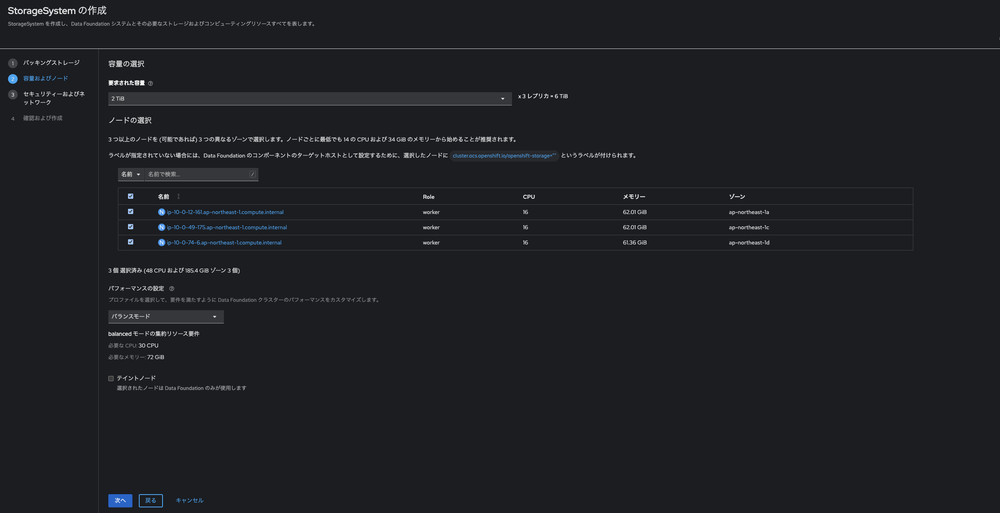

# OpenShift Virtualizationの構築

本トピックでは、AWS上にOpenShiftをIPI（Installer Provisioned Infrastructure）方式でインストールし、OpenShift Virtualizationを利用可能にするまでの流れを解説します。

## 準備編：OpenShiftのインストール方法について

OpenShiftの[インストール](https://docs.redhat.com/en/documentation/openshift_container_platform/4.19/html/installation_overview/ocp-installation-overview)は、以下の方法が提供されています。

| 方法 | 概要 | 特徴 |
|------|------|------|
| IPI（Installer Provisioned Infrastructure）| インフラ構成をOpenShiftインストーラが自動作成 | 簡単・自動化された構築 |
| UPI（User Provisioned Infrastructure）| インフラは手動で用意し、OpenShiftのみインストール | カスタマイズ性が高い |
| Assisted Installer | Red HatのWebコンソールを使ってGUIベースで構築 | 小規模・エッジ用途向け |
| Agent-based Installer | インターネットを使わず、ローカルCLIで構築 | 閉域・オフライン環境向け |

本手順では、もっともシンプルな「IPI方式」を採用します。

## OpenShiftのインストール
それでは、早速インストールに進みましょう。

### 踏み台サーバへSSHログイン

提供された踏み台サーバにSSHでアクセスします。
`<foo>.<bar>`の箇所は、講師の指示に従ってください。


```
$ ssh lab-user@bastion.<foo>.<bar>.opentlc.com
```

### install-config.yamlの作成

OpenShiftの構成を記述した `install-config.yaml` を作成します。

```
[lab-user@bastion ~]$ vi install-config.yaml
```

適宜、`YOUR_PULL_SECRET`、`sandboxXXX` を書き換えてください。


```
apiVersion: v1
baseDomain: sandboxXXX.opentlc.com
compute:
- architecture: amd64
  hyperthreading: Enabled
  name: worker
  platform: 
    aws:
      type: m5.4xlarge # インスタンスタイプ
  replicas: 3 
controlPlane:
  architecture: amd64
  hyperthreading: Enabled
  name: master
  platform: {}
  replicas: 3
metadata:
  creationTimestamp: null
  name: demo
networking:
  clusterNetwork:
  - cidr: 10.128.0.0/14
    hostPrefix: 23
  machineNetwork:
  - cidr: 10.0.0.0/16
  networkType: OVNKubernetes
  serviceNetwork:
  - 172.30.0.0/16
platform:
  aws:
    region: ap-northeast-1
publish: External
pullSecret: 'YOUR_PULL_SECRET'
```

## OpenShiftをIPIでインストール

`install-config.yaml` を作成したら、`config` ディレクトリを作成し、そのディレクトリ配下へinstall-config.yamlを移動します。
そして、`openshift-install` コマンドを実行し、OpenShiftのインストールを開始します。

また、途中でAWSの `ACCESS_KEY` と `SECRET_ACCESS_KEY` の入力を求められますので、講師に案内された各自の環境に合わせた情報を入力してください。

```
[lab-user@bastion ~]$ mkdir config
[lab-user@bastion ~]$ mv install-config.yaml config
[lab-user@bastion ~]$ openshift-install create cluster --dir=./config
? AWS Access Key ID xxx
? AWS Secret Access Key [? for help] ****************************************
...

INFO All cluster operators have completed progressing 
INFO Checking to see if there is a route at openshift-console/console... 
INFO Install complete!                            
INFO To access the cluster as the system:admin user when using 'oc', run 
INFO     export KUBECONFIG=/home/lab-user/config/auth/kubeconfig 
INFO Access the OpenShift web-console here: https://console-openshift-console.apps.demo.sandbox<XXX>.opentlc.com 
INFO Login to the console with user: "kubeadmin", and password: "<Passowrd>" 
INFO Time elapsed: 42m51s  
```

インストール完了まで40-50分程度かかるため、気長に待ちましょう。

### インストール完了を確認
`openshift-install`コマンドの実行ログに、`INFO Install complete! `が出力されたら、インストールが無事完了です。

OpenShiftは、Kubernetesの標準サービスの他、認証・認可やノード管理、バージョン管理など、クラスタ運用に必要な様々なKubernetes Operatorが稼働しています。
このOpenShift標準サービスを`Cluster Operator`と呼びます。

念の為、`Cluster Operator`の状態を確認してみましょう。

以下の実行結果の内、すべてのコンポーネントが `AVAILABLE=True` であれば、正常にインストールされています。

最初に、インストーラが生成した`kubeconfig`のパスを、`KUBECONFIG`環境変数に指定します。
```
[lab-user@bastion ~]$ export KUBECONFIG=/home/lab-user/config/auth/kubeconfig
```

そして、以下のコマンドを実行してください。

```
[lab-user@bastion ~]$ oc get co
NAME                                       VERSION   AVAILABLE   PROGRESSING   DEGRADED   SINCE   MESSAGE
authentication                             4.18.19   True        False         False      10m     
baremetal                                  4.18.19   True        False         False      28m     
cloud-controller-manager                   4.18.19   True        False         False      31m     
cloud-credential                           4.18.19   True        False         False      33m     
cluster-autoscaler                         4.18.19   True        False         False      28m     
config-operator                            4.18.19   True        False         False      29m     
console                                    4.18.19   True        False         False      18m     
control-plane-machine-set                  4.18.19   True        False         False      25m     
csi-snapshot-controller                    4.18.19   True        False         False      29m     
dns                                        4.18.19   True        False         False      28m     
etcd                                       4.18.19   True        False         False      28m     
image-registry                             4.18.19   True        False         False      20m     
ingress                                    4.18.19   True        False         False      20m     
insights                                   4.18.19   True        False         False      28m     
kube-apiserver                             4.18.19   True        False         False      26m     
kube-controller-manager                    4.18.19   True        False         False      26m     
kube-scheduler                             4.18.19   True        False         False      25m     
kube-storage-version-migrator              4.18.19   True        False         False      29m     
machine-api                                4.18.19   True        False         False      25m     
machine-approver                           4.18.19   True        False         False      28m     
machine-config                             4.18.19   True        False         False      28m     
marketplace                                4.18.19   True        False         False      28m     
monitoring                                 4.18.19   True        False         False      17m     
network                                    4.18.19   True        False         False      30m     
node-tuning                                4.18.19   True        False         False      20m     
olm                                        4.18.19   True        False         False      19m     
openshift-apiserver                        4.18.19   True        False         False      21m     
openshift-controller-manager               4.18.19   True        False         False      24m     
openshift-samples                          4.18.19   True        False         False      20m     
operator-lifecycle-manager                 4.18.19   True        False         False      28m     
operator-lifecycle-manager-catalog         4.18.19   True        False         False      28m     
operator-lifecycle-manager-packageserver   4.18.19   True        False         False      21m     
service-ca                                 4.18.19   True        False         False      29m     
storage                                    4.18.19   True        False         False      28m
```

### OpenShiftコンソールへのアクセス
ブラウザを開き、OpenShiftコンソールへアクセスします。

コンソールのURLは、`openshift-install`コマンドの実行ログに記載されています。
見失ってしまった方は、以下のコマンドを実行すれば、実行ログを出力できます。

```
[lab-user@bastion ~]$ cat config/.openshift_install.log
...
time="2025-07-15T09:32:05Z" level=info msg="Access the OpenShift web-console here: https://console-openshift-console.apps.demo.sandboxXXX.opentlc.com"
time="2025-07-15T09:32:05Z" level=info msg="Login to the console with user: \"kubeadmin\", and password: \"************\""
...
```

OpenShiftは、デフォルトで自己証明書を使用しているため、ブラウザで上記のURLにアクセスすると、セキュリティ警告の画面が表示されます。


`[詳細設定]`を押下し、`oauth-openshift.apps....にアクセスする（安全ではありません）`のリンクを開きます。


すると、ログイン画面に遷移します。


ユーザ名とパスワードの欄に、`openshift-install`コマンドの実行ログに出力されている `console with user: "kubeadmin"`と、 `password: "<Passowrd>" `を入力し、`[ログイン]`ボタンを押下します。

以下のように、OpenShiftコンソールが表示されることを確認してください。


### CLIからのOpenShiftクラスタへのログイン
インストーラの生成したkubeconfigは権限が多すぎるため、CLIでOpenShiftクラスタを操作する際は、通常、`oc login`コマンドでOpenShiftにログインし、操作します。

OpenShiftでは、`User`と`Group`の単位で、クラスタへアクセスするユーザと権限を制御します。
以降のハンズオンでは、フル権限を持つ `kubeadmin`ユーザを使用しますが、通常は、kubeadminユーザは削除し、クラスタ管理者権限を持つ個別のユーザを使用することが推奨されます。

また、GUIログイン以降、次の流れで、`oc login`でアクセスするためのテンポラリトークンを払い出すことができます。


画面右上の`[kube:admin]`のメニューをクリックします。


続いて、「ログインコマンドのコピー」というメニューをクリックします。


画面右上の`[Display Token]`リンクをクリックします。


すると、「Log in with this token」という箇所に、`oc login`のコマンドが表示されます。


このコマンドをコピーして、踏み台サーバ上で実行してみましょう。

初回ログイン時は、`Use insecure connections? (y/n): `と表示されるので、`y`を入力してEnterを押下してください。

```
[lab-user@bastion ~]$ oc login --token=*** --server=https://api.demo.sandboxXXX.opentlc.com:6443
...
Using project "default".
```

## OpenShift Virtualization用ノードの追加

本ハンズオンでは、AWSベアメタルインスタンス(c5n.metal)をクラスタに追加し、仮想マシンを実行するノードとして利用します。

### MachineSetのマニフェストを作成
まず、OpenShiftクラスタの識別子を特定してください。

```
[lab-user@bastion ~]$ export infrastructure_ID=$(oc get machineset -A | grep worker-ap-northeast-1a | awk '{print $2}' | sed 's/-worker.*//')
```

そして、AWSのOpenShiftのホストOSであるRed Hat Enterprise Linux CoreOS(RHCOS)の、AMI IDを特定します。

```
[lab-user@bastion ~]$ export ami_id=$(oc get configmap/coreos-bootimages -n openshift-machine-config-operator -o jsonpath='{.data.stream}' | jq -r '.architectures.x86_64.images.aws.regions."ap-northeast-1".image')
```

OpenShiftでは、新規ノード追加を`MachineSet`というAPIで自動化します。
MachineSetのマニフェストを作成します。

```
[lab-user@bastion ~]$ vi machine-bm.yaml
```

```
apiVersion: machine.openshift.io/v1beta1
kind: MachineSet
metadata:
  name: ${infrastructure_ID}-bm-worker-ap-northeast-1a
  namespace: openshift-machine-api
  labels:
    machine.openshift.io/cluster-api-cluster: ${infrastructure_ID}
spec:
  replicas: 2 # ノードを2台追加します。
  selector:
    matchLabels:
      machine.openshift.io/cluster-api-cluster: ${infrastructure_ID}
      machine.openshift.io/cluster-api-machineset: ${infrastructure_ID}-bm-worker-ap-northeast-1a
  template:
    metadata:
      labels:
        machine.openshift.io/cluster-api-cluster: ${infrastructure_ID}
        machine.openshift.io/cluster-api-machine-role: worker
        machine.openshift.io/cluster-api-machine-type: worker
        machine.openshift.io/cluster-api-machineset: ${infrastructure_ID}-bm-worker-ap-northeast-1a
    spec:
      lifecycleHooks: {}
      metadata:
        labels:
          node-role.kubernetes.io/worker: "" # 追加するノードの用途をラベルで指定
      providerSpec:
        value:
          userDataSecret:
            name: worker-user-data
          placement:
            availabilityZone: ap-northeast-1a
            region: ap-northeast-1
          credentialsSecret:
            name: aws-cloud-credentials
          instanceType: c5n.metal # インスタンスタイプを指定
          metadata:
            creationTimestamp: null
          blockDevices:
            - ebs:
                encrypted: true
                iops: 0
                kmsKey:
                  arn: ''
                volumeSize: 120
                volumeType: gp3
          securityGroups:
            - filters:
                - name: 'tag:Name'
                  values:
                    - ${infrastructure_ID}-node
            - filters:
                - name: 'tag:Name'
                  values:
                    - ${infrastructure_ID}-lb
          kind: AWSMachineProviderConfig
          metadataServiceOptions: {}
          tags:
            - name: kubernetes.io/cluster/${infrastructure_ID}
              value: owned
          deviceIndex: 0
          ami:
            id: ${ami_id}
          subnet:
            filters:
              - name: 'tag:Name'
                values:
                  - ${infrastructure_ID}-subnet-private-ap-northeast-1a
          apiVersion: machine.openshift.io/v1beta1
          iamInstanceProfile:
            id: ${infrastructure_ID}-worker-profile
```

### MachineSetをOpenShiftクラスタに追加

作成したMachineSetのマニフェストをOpenShiftクラスタへapplyします。
なお、環境変数 `infrastructure_ID`と`ami_id`を `envsubst`で展開する形でapplyしましょう。

```
[lab-user@bastion ~]$ cat machine-bm.yaml | envsubst | oc apply -f -
```

`oc get machineset`コマンドを実行すると、`${infrastructure_id}-bm-worker-ap-northeast-1a`という名前で、MachineSetが追加されたことを確認できます。

```
[lab-user@bastion ~]$ oc get machineset -A
NAMESPACE               NAME                                   DESIRED   CURRENT   READY   AVAILABLE   AGE
openshift-machine-api   demo-97sfb-bm-worker-ap-northeast-1a   2         2         2       2           23m
openshift-machine-api   demo-97sfb-worker-ap-northeast-1a      1         1         1       1           62m
openshift-machine-api   demo-97sfb-worker-ap-northeast-1c      1         1         1       1           62m
openshift-machine-api   demo-97sfb-worker-ap-northeast-1d      1         1         1       1           62m
```

ノードの追加には20分程度かかるため、次のステップに進みましょう。
なお、OpenShiftコンソールから、ノードが正常に追加されたことを確認できます。

## OpenShift Data Foundationのインストール

本ハンズオンでは、ストレージとして、OpenShift Data Foundation(ODF)を使用します。
ODFは、rook/cephベースのコンテナストレージです。OpenShift Platform PlusというOpenShift Editionに含まれます。

なお、OpenShiftでは、ストレージとして、NFSやその他の各種ストレージアプライアンスを利用することも可能です。

### OpenShift Data Foundation Operatorのインストール

`[管理者向け表示]`の画面で、`[Operator]` > `[OperatorHub]`をクリックします。そして、検索ボックスに「OpenShift Data Foundation」と入力してください。


真ん中の「OpenShift Data Foundation」のタイルをクリックすると、Operatorの紹介画面が表示されます。何も考えず`[インストール]`ボタンを押下しましょう。


続いて、`[Operatorのインストール]`画面が表示されます。
デフォルトの設定のまま、「インストール」ボタンを押下してください。


`[Operator]` > `[インストール済みのOperator]`画面で、「OpenShift Data Foundation」および「OpenShift Data Foundation Client」のステータスが「✅Succeed」であることを確認します。


`[インストール済みのOperator]`画面で、`[OpenShift Data Foundation]`をクリックします。すると、`StorageSystemの作成`というボタンが表示されているはずです。ボタンを押下しましょう。


### StorageSystemリソースの作成

以下の画面の通り、設定を選択してStorageSystemを作成してください。

#### 「バッキングストレージ」の設定


- Deploymentタイプ：完全なデプロイメント
- バッキングストレージのタイプ：既存のStorageClassの使用
- ネットワークファイルシステム(NFS)：✅
- Ceph RBDをデフォルトのStorageClassとして使用する：✅

`[次へ]`ボタンを押下

#### 「容量およびノード」の設定
 

- 要求された容量：2TB
- ノードの選択：すべてのノードを✅

その他の設定はデフォルトのまま `[次へ]`ボタンを押下

#### 「セキュリティおよびネットワーク」の設定

デフォルトのまま`[次へ]`

 

#### 確認および作成

`[StorageSystemの作成]`ボタンを押下

ODFのインストールには十分程度時間がかかるため、次のステップへ進んでください。

> Note. インストール中に、画面のリロードを求められますので、リロードしてください。ODFがインストールされると、OpenShiftコンソールの`[ストレージ]`メニューに、ODFのメニューが追加されます。

なお、`[インストール済みのOperator]` > `[OpenShift Data Foundation]` > `[StorageSystem]` > `[ocs-storagecluster-storagesystem]`のページの一番下が、以下の状態となれば、正常にODFがインストールされています。


念の為、Podの状態が以下の通りになることも確認しておきましょう！

```
[lab-user@bastion ~]$ oc get po -n openshift-storage                                                                              (base) 
NAME                                                              READY   STATUS      RESTARTS   AGE
ceph-csi-controller-manager-6c9dd5975b-8qhqw                      2/2     Running     0          46h
csi-addons-controller-manager-85858865c7-2klk4                    2/2     Running     0          46h
csi-cephfsplugin-5zrwt                                            3/3     Running     0          46h
csi-cephfsplugin-94kck                                            3/3     Running     0          46h
csi-cephfsplugin-hn2c9                                            3/3     Running     0          46h
csi-cephfsplugin-ht9ms                                            3/3     Running     0          46h
csi-cephfsplugin-kt9rf                                            3/3     Running     0          46h
csi-cephfsplugin-provisioner-7fdbff4779-7mhxb                     7/7     Running     0          46h
csi-cephfsplugin-provisioner-7fdbff4779-hwk7q                     7/7     Running     0          46h
csi-nfsplugin-ch5bv                                               3/3     Running     0          46h
csi-nfsplugin-d8j77                                               3/3     Running     0          46h
csi-nfsplugin-provisioner-59d96755b6-cv8z6                        6/6     Running     0          46h
csi-nfsplugin-provisioner-59d96755b6-vxl2b                        6/6     Running     0          46h
csi-nfsplugin-t87tm                                               3/3     Running     0          46h
csi-nfsplugin-thrs2                                               3/3     Running     0          46h
csi-nfsplugin-tvhch                                               3/3     Running     0          46h
csi-rbdplugin-9mssj                                               4/4     Running     0          46h
csi-rbdplugin-lmst4                                               4/4     Running     0          46h
csi-rbdplugin-n5zx2                                               4/4     Running     0          46h
csi-rbdplugin-provisioner-55ccb4f4b-96nhk                         7/7     Running     0          46h
csi-rbdplugin-provisioner-55ccb4f4b-mgrbr                         7/7     Running     0          46h
csi-rbdplugin-tqrmk                                               4/4     Running     0          46h
csi-rbdplugin-wm67g                                               4/4     Running     0          46h
noobaa-core-0                                                     2/2     Running     0          46h
noobaa-db-pg-0                                                    1/1     Running     0          46h
noobaa-endpoint-5898649ddf-mxfpd                                  1/1     Running     0          45h
noobaa-operator-66d6987cd8-76nzw                                  1/1     Running     0          46h
ocs-metrics-exporter-6f945875f-r4jjc                              3/3     Running     0          46h
ocs-operator-86bc99bd5f-s7dmb                                     1/1     Running     0          46h
odf-console-df48f4dfc-2wpfv                                       1/1     Running     0          46h
odf-operator-controller-manager-7d97f5b58b-ww8dq                  2/2     Running     0          46h
rook-ceph-crashcollector-43c5e4cdd3728aca89fa51e6c0b1ed22-jqvsl   1/1     Running     0          46h
rook-ceph-crashcollector-4eb57a5534149eb87f4a6d582d938825-cjgcd   1/1     Running     0          46h
rook-ceph-crashcollector-7804e062f6816638bdba2f2d5b9123f3-9rjcx   1/1     Running     0          46h
rook-ceph-exporter-43c5e4cdd3728aca89fa51e6c0b1ed22-6d5b69mrfs5   1/1     Running     0          46h
rook-ceph-exporter-4eb57a5534149eb87f4a6d582d938825-5d4985fnlc4   1/1     Running     0          46h
rook-ceph-exporter-7804e062f6816638bdba2f2d5b9123f3-58cb8dbxtk5   1/1     Running     0          46h
rook-ceph-mds-ocs-storagecluster-cephfilesystem-a-5c7697f9mmtpp   2/2     Running     0          46h
rook-ceph-mds-ocs-storagecluster-cephfilesystem-b-5c9dc5bclpbqx   2/2     Running     0          46h
rook-ceph-mgr-a-6d6d798fb6-mhlbs                                  3/3     Running     0          46h
rook-ceph-mgr-b-5f5b64db4c-fgrqn                                  3/3     Running     0          46h
rook-ceph-mon-a-88cbcdc9-rs5jw                                    2/2     Running     0          46h
rook-ceph-mon-b-777f4d7555-btw5p                                  2/2     Running     0          46h
rook-ceph-mon-c-7b9767d979-mjmwl                                  2/2     Running     0          46h
rook-ceph-nfs-ocs-storagecluster-cephnfs-a-86cbb47fb-dglx5        2/2     Running     0          46h
rook-ceph-operator-869467c85f-l6dwv                               1/1     Running     0          46h
rook-ceph-osd-0-598c7b767-pstdk                                   2/2     Running     0          46h
rook-ceph-osd-1-55d745d45d-jbwkx                                  2/2     Running     0          46h
rook-ceph-osd-2-6c79bb555d-lf9ct                                  2/2     Running     0          46h
rook-ceph-osd-prepare-5e7e3abf5341b20302c817c424f84ddd-tp6kp      0/1     Completed   0          46h
rook-ceph-osd-prepare-79072abe5ba8969f1c6efcada45c4ffa-5prgk      0/1     Completed   0          46h
rook-ceph-osd-prepare-a1332931e626681ab550094d12d79174-rr7l2      0/1     Completed   0          46h
ux-backend-server-68b88df999-bb9mv                                2/2     Running     0          46h
```


### デフォルトのStorageClassの変更

本ハンズオンでは、AWS上にOpenShiftをインストールしたため、デフォルトのStorageClassが、`gp3-csi`に設定されています。

以下の手順で、デフォルトのStorageClassを、ODFに変更しましょう。

`[ストレージ]` > `[StorageClass]`を開きます。


`[gp3-csi]`をクリックし、`[YAML]`ビューへ切り替えます。
そして、以下の箇所を削除して、`[保存]`ボタンを押下します。


```
  annotations:
    storageclass.kubernetes.io/is-default-class: 'true'
```

再度、`[StorageClass]`を開き、`gp3-csi`の横の「デフォルト」という文字列が消えていることを確認します。


## OpenShift Virtualizationのインストール

いよいよ本題のOpenShift Virtualizationのインストールに進みましょう！

インストールを進める前に、ノードの状態を確認しておきます。
以下の通り、ROLES列似て、
- `control-plane,master`: 3台
- `worker`: 5台

の`STATUS`列が、全て`Ready`であることを確認しましょう。

> Note. 本ハンズオン環境は、デフォルトで、Master 3台、Worker 3台が払い出されています。ベアメタルインスタンスを2台追加したため、OpenShift Virtualizationをインストールする時点では、Workerが5台であることを確認しておきましょう。

```
[lab-user@bastion ~]$ oc get nodes
NAME                                             STATUS   ROLES                  AGE   VERSION
ip-10-0-0-62.ap-northeast-1.compute.internal     Ready    control-plane,master   49m   v1.31.10
ip-10-0-12-161.ap-northeast-1.compute.internal   Ready    worker                 37m   v1.31.10
ip-10-0-2-152.ap-northeast-1.compute.internal    Ready    worker                 58s   v1.31.10
ip-10-0-28-29.ap-northeast-1.compute.internal    Ready    worker                 70s   v1.31.10
ip-10-0-37-90.ap-northeast-1.compute.internal    Ready    control-plane,master   49m   v1.31.10
ip-10-0-49-175.ap-northeast-1.compute.internal   Ready    worker                 41m   v1.31.10
ip-10-0-74-6.ap-northeast-1.compute.internal     Ready    worker                 41m   v1.31.10
ip-10-0-76-34.ap-northeast-1.compute.internal    Ready    control-plane,master   49m   v1.31.10
```

### OpenShift Virtualization Operatorのインストール
`[Operator]` > `[OperatorHub]`を開き、検索ボックスへ「OpenShift Virtualization」と入力します。

そして、`[OpenShift Virtualization]`タイルをクリックしてください。


ODFの時と同様、Operatorの紹介画面が開きます。何も考えず`[インストール]`ボタンを押下します。


続いて、`[Operatorのインストール]`画面へ遷移しますので、`[インストール]`ボタンを押下してください。


`[インストール済みのOperator]`画面で、「OpenShift Virtualization」をクリックします。


すると、`[HyperConvergedの作成]`ボタンが表示されているはずです。
ボタンをクリックし、デフォルトの設定のまま`[作成]`ボタンを押下してください。


> Note. インストール中に、画面のリロードを求められますので、リロードしてください。OpenShift Virtualizationがインストールされると、OpenShiftコンソールの`[管理者向け表示]`のメニューに、`[Virtualization]`というOpenShift Virtualizationのメニューが追加されます。

なお、`[インストール済みのOperator]` > `[OpenShift Virtualization]` > `[OpenShift Virtualization Deloyment]` > `[kubevirt-hyperconverged]`のページの一番下が、以下の状態となれば、正常にインストールされています。


また、念の為、CLIでPodの状態が以下の通りであることを確認しましょう。

```
[lab-user@bastion ~]$ oc get po -n openshift-cnv                                                
NAME                                                   READY   STATUS    RESTARTS      AGE
aaq-operator-6bb68fd74b-thldw                          1/1     Running   0             46h
bridge-marker-5vmjl                                    1/1     Running   0             46h
bridge-marker-6rrlc                                    1/1     Running   0             46h
bridge-marker-v2rrj                                    1/1     Running   0             46h
bridge-marker-w8xfs                                    1/1     Running   0             46h
bridge-marker-z9nsf                                    1/1     Running   0             46h
cdi-apiserver-5cc8d6d679-pr5lr                         1/1     Running   0             46h
cdi-deployment-b995bc684-68glp                         1/1     Running   0             46h
cdi-operator-7948b9d577-lzn52                          1/1     Running   0             46h
cdi-uploadproxy-6b5494fcb7-ldnb4                       1/1     Running   0             46h
cluster-network-addons-operator-848599966d-64cnd       2/2     Running   0             46h
hco-operator-6bfb88cbfc-fpz2g                          1/1     Running   0             46h
hco-webhook-68dc9579df-49624                           1/1     Running   0             46h
hostpath-provisioner-operator-fd46878b4-wk4px          1/1     Running   0             46h
hyperconverged-cluster-cli-download-5794fc9b9f-pgc6l   1/1     Running   0             46h
kube-cni-linux-bridge-plugin-545ht                     1/1     Running   0             46h
kube-cni-linux-bridge-plugin-8bzpx                     1/1     Running   0             46h
kube-cni-linux-bridge-plugin-lhjb9                     1/1     Running   0             46h
kube-cni-linux-bridge-plugin-ntwj5                     1/1     Running   0             46h
kube-cni-linux-bridge-plugin-qx494                     1/1     Running   0             46h
kubemacpool-cert-manager-65967d6c64-7tmf5              1/1     Running   0             46h
kubemacpool-mac-controller-manager-8588c9dbfd-xvz66    2/2     Running   0             46h
kubevirt-apiserver-proxy-5fdcbf796f-c5cv7              1/1     Running   0             46h
kubevirt-apiserver-proxy-5fdcbf796f-rd68d              1/1     Running   0             46h
kubevirt-console-plugin-997df8967-gxtpb                1/1     Running   0             46h
kubevirt-console-plugin-997df8967-ntjk7                1/1     Running   0             46h
kubevirt-ipam-controller-manager-6b4db57bf9-5g2ps      1/1     Running   0             46h
passt-binding-cni-6x6xk                                1/1     Running   0             46h
passt-binding-cni-7nqz5                                1/1     Running   0             46h
passt-binding-cni-d76v8                                1/1     Running   0             46h
passt-binding-cni-d78nw                                1/1     Running   0             46h
passt-binding-cni-trnd5                                1/1     Running   0             46h
ssp-operator-869d8cd5fc-x69xq                          1/1     Running   1 (46h ago)   46h
virt-api-769fc75499-7np5g                              1/1     Running   0             46h
virt-api-769fc75499-w78r8                              1/1     Running   0             46h
virt-controller-66588cbd97-sc86k                       1/1     Running   0             46h
virt-controller-66588cbd97-zkpp8                       1/1     Running   0             46h
virt-exportproxy-56bd5d8b48-9dxfz                      1/1     Running   0             46h
virt-exportproxy-56bd5d8b48-n489v                      1/1     Running   0             46h
virt-handler-4bxxt                                     1/1     Running   0             46h
virt-handler-7dndk                                     1/1     Running   0             46h
virt-handler-9np7p                                     1/1     Running   0             46h
virt-handler-dswp8                                     1/1     Running   0             46h
virt-handler-th86r                                     1/1     Running   0             46h
virt-operator-cc77bcbc7-mxzv6                          1/1     Running   0             46h
virt-operator-cc77bcbc7-nj5vs                          1/1     Running   0             46h
virt-template-validator-77cb99d8f5-sn4fq               1/1     Running   0             46h
virt-template-validator-77cb99d8f5-wg6z8               1/1     Running   0             46h
```
