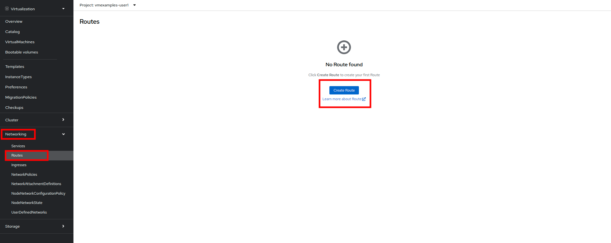

# 仮想マシンへのアクセス

## はじめに

このトピックでは、OpenShift上に展開された仮想マシンを、`Service`と`Route`を使用して、外部からアクセスできることを確認します。

## Service/Routeによるアプリケーションの公開

デフォルトでは、仮想マシンは SDN に接続されており、これは残りのネットワークへのアクセスを与えるための便利で簡単な方法です。しかし、仮想マシンや OpenShift クラスタ内の他のPodが仮想化アプリケーションを見つけ、接続するのは難しい場合があります。

これを解決するために、WindowsベースのWebサーバー2台への接続を分散する *Service* を使用し、各Serviceディスカバリ用のDNSエントリを作成し、外部クライアントが仮想マシン内でホストされているアプリケーションにアクセスできるように *Route* を作成します。

### Service

*Service* はトラフィックのソース/ターゲットを識別し、ラベルに基づいてクライアントをエンドポイントに誘導します。 現時点では、VMにはまだラベルが割り当てられていません。

VMをServiceに正しく関連付けるには、以下の作業が必要です。

* VMにラベルを追加します。 両方のWindows IISサーバーは同じロードバランサーの後ろにあるため、同じラベルを使用します。
* 2つのWindows IISサーバーをクラスター上の他のワークロードで利用できるように、Serviceを作成します。OpenShiftは、Serviceの名前をDNS名として使用して、ロードバランサーを自動的に内部からアクセスできるようにします。
* *Route* を作成して、OpenShiftの外部からServiceを利用できるようにします。

まず、OpenShiftの仮想化GUIで仮想マシンの定義を変更し、仮想マシンにラベルを追加します。

### 仮想マシンにラベルを追加

. 左側の列で *VirtualMachines* をクリックし、インポートした3つの仮想マシンがまだ起動していない場合は起動します。右側のツリービューで *Status* の列をソートすると、簡単に確認できます。
+
image::2025_spring/module-08-workingvms/11_Imported_VMs_List.png[link=self, window=blank, width=100%]
+
NOTE: *Migrating Existing Virtual Machines*（既存の仮想マシンの移行）モジュールを完了した場合は *vmexamples-{user}*、完了していない場合は *vmimported-{user}* という正しいプロジェクトを選択してください。

. *winweb01-{user}* VMを選択し、*YAML* タブに移動します。
. *spec:* セクションを見つけ、*template.metadata* の下の *labels* セクションに次の行を追加します。
+

```
env: webapp
```

> IMPORTANT: インデントを正確に取得するようにしてください。


. *winweb02-{user}* VMに対し同じ操作を繰り返します。

. *winweb01-{user}* と *winweb02-{user}* の両方の仮想マシンを再起動します。

> NOTE. 各仮想マシンのコンソールタブにアクセスして、仮想マシンが適切に動作していることを確認してください。

### Serviceの作成

左側のメニューで *Networking* を展開し、*Services* をクリックします。読み込まれた画面で、画面の隅にある *Create Service* ボタンをクリックします。


YAMLを以下の定義に置き換えます:
```
apiVersion: v1
kind: Service
metadata:
  name: webapp
  namespace: vmexamples-{user}
spec:
  selector:
    env: webapp
  ports:
  - protocol: TCP
    port: 80
    targetPort: 80
```

> IMPORTANT: 仮想マシンで使用する *namespace* （*vmexamples-{user}* または *vmimported-{user}*）が、Service YAMLで使用されているものと同じであることを確認してください。


画面下部の *Create* ボタンをクリックします。 YAML が保存されたという通知が表示されます。
新しく作成された *webapp* Serviceの詳細ページで、*Pod selector* リンクを見つけ、クリックします。


. 2つのWindows VMがServiceによって適切に識別され、対象となっていることを確認します。


## Routeの作成

これで、Windows IIS サーバーは OpenShift クラスター内からアクセスできるようになりました。 他の仮想マシンは、Service名 + ネームスペース名から決定される DNS 名 **webapp.vmexamples-{user}** を使用して、それらにアクセスできます。しかし、これらの Web サーバーはアプリケーションのフロントエンドであるため、外部からアクセスできるようにしたいと思います。 これは *Route* を使用してパブリックに公開することで実現できます。

*Networking* の下で、左側のナビゲーションメニューの *Routes* オプションをクリックします。 画面中央の *Create Route* ボタンをクリックします。



. 以下の情報を使用してフォームに入力し、一番下までスクロールして、完了したら *Create* をクリックします。

- *Name*: *route-webapp*
- *Service*: *webapp*
- *Target port*: *80 -> 80 (TCP)*
- *Secure Route*: *Enabled*
- *TLS termination*: *Edge*
- *Insecure traffic*: *Redirect*


*Location* フィールドに表示されているアドレスに移動します。


ページがロードされると、エラーが表示されます。何かがおかしいようです。これは、Windowsウェブサーバーが移行後のデータベースVMに接続できないためです。


> NOTE. 接続性の問題に対処するため、データベース VM にServiceを作成して、ウェブサーバーからアクセスできるようにする必要があります。

再度、*Networking* -> *Services* に移動し、*Create Service* をクリックします。 YAML を以下の定義に置き換えます:


```
apiVersion: v1
kind: Service
metadata:
  name: database
  namespace: vmexamples-{user}
spec:
  selector:
    vm.kubevirt.io/name: database-{user}
  ports:
  - protocol: TCP
    port: 3306
    targetPort: 3306
----
```


> IMPORTANT. 仮想マシン用の名前空間、*vmexamples-{user}* または *vmimported-{user}* が、Service YAMLで使用されている名前空間と一致していることを確認してください。

YAMLを貼り付けたら、*Create* ボタンをクリックします。
ブラウザでWebapp URLをリロードし、移行したWebアプリケーションが適切に動作していることを確認します。

