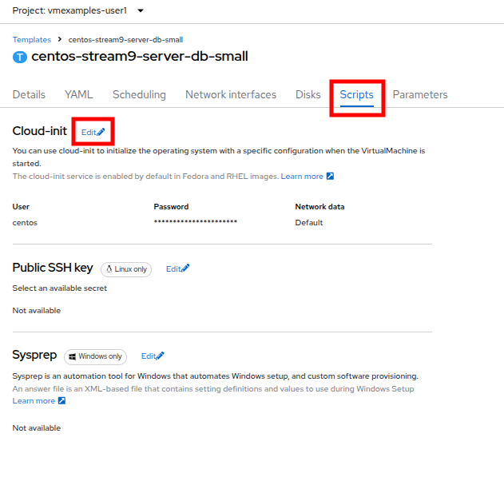
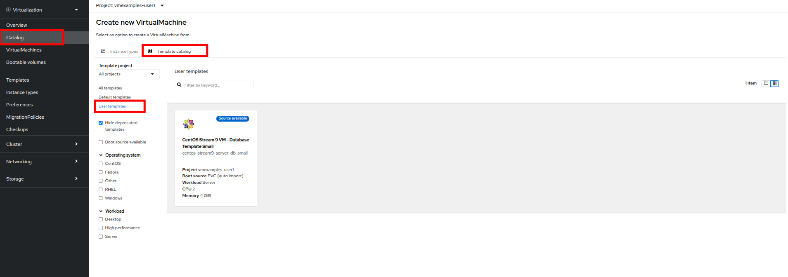
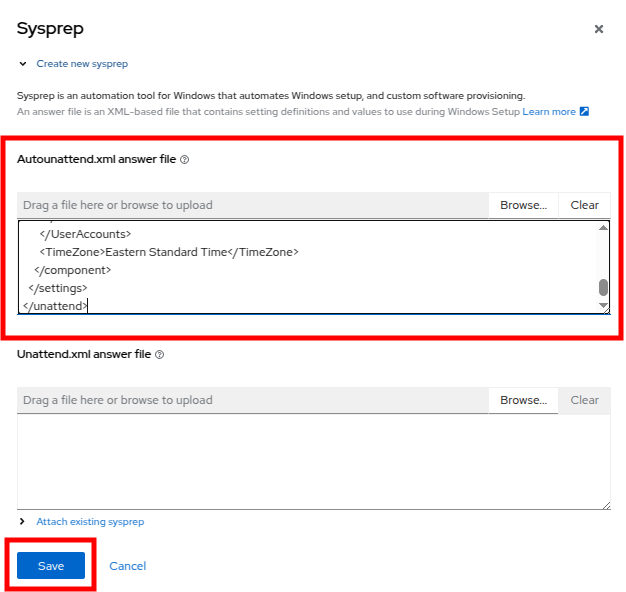
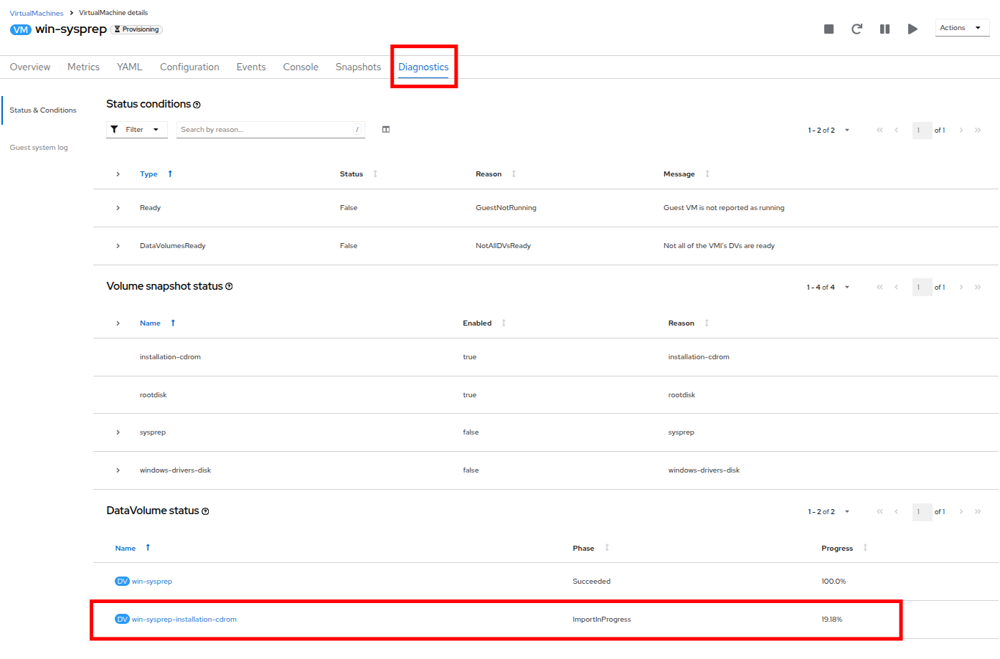

# 仮想マシンの作成

## はじめに

OpenShift Virtualization では、あらかじめ設定済みの仮想マシンテンプレートが `[Virtualization]` > `[Templates]` ページに一覧表示されます。これらは Red Hat Enterprise Linux、Fedora、CentOS、Microsoft Windows などのOSごとに用意されています。

Red Hat 提供のテンプレートには以下が含まれています：
- OSイメージ（起動元）
- OSの初期設定
- CPU/メモリの構成（フレーバー）
- ワークロードタイプ（例：サーバー）

その他のOS用テンプレートにはOSイメージは含まれませんが、推奨される構成がセット済みです。

### テンプレートの種類

テンプレートには以下の4種類があります。

| 種類 | 説明 |
|------|------|
| **Red Hat Supported** | Red Hat が完全サポートするテンプレート |
| **User Supported** | Red Hat のテンプレートをユーザーが複製して作成したもの |
| **Red Hat Provided** | Red Hat が限定的に提供するテンプレート |
| **User Provided** | Red Hat Provided をユーザーが複製したもの |


## 準備

1. 左メニューから `[Virtualization]` > `[VirtualMachines]` を開きます。
2. `handson` プロジェクトを展開します。
3. Running 状態のVMがあれば、選択して `[Actions]` > `[Stop]` をクリックしてください。


## テンプレートの複製とカスタマイズ

### プロジェクトを選択
左メニューから *Templates* をクリックし、プロジェクトとして `openshift` を選択してください。

   - 必要に応じて *Show default projects* を有効化します。
   - *openshift* プロジェクトを表示するには、*Show default projects* ボタンを切り替える必要があるかもしれません。


### centos9のテンプレートを検索

検索バーで `centos9` を検索し、`centos-stream9-server-small` を見つけます。


### カスタムテンプレートの作成
テンプレート名をクリックし、**Create a new custom Template** を選択します。


`Clone template` 画面で以下を入力してください。
- Template name: `centos-stream9-server-db-small`
- Project: `vmexamples-{user}`
- Display name: `CentOS Stream 9 VM - Database Template Small`
- Provider: `Roadshow {user}`

 

### CPUとメモリを編集
CPU と メモリを、CPU: 2, Memory: 4GiB　へ修正します。

`[Details]`タブをクリックし、詳細画面を表示します。


そして、`CPU|Memory`の箇所の鉛筆マークをクリックしてください。


### Cloud-initの編集

`[Scripts]`タブ > `[Cloud-init]` > `[Edit]` をクリックします。



`[Cloud-init]`ダイアログが開いたら、*Configure via: Script* のラジオボタンをクリックし、以下の YAML スニペットで YAML を置き換えます。

```
userData: |-
  #cloud-config
  user: centos
  password: ${CLOUD_USER_PASSWORD}
  chpasswd: { expire: False }
  packages:
    - mariadb-server
  runcmd:
    - systemctl enable mariadb
    - systemctl start mariadb
```


`[Save]`ボタンをクリックすると、*Saved* という緑色のプロンプトが表示されます。その後、*Apply* ボタンをクリックします。

### カタログからテンプレートを選択
左側のメニューにある `[Catalog]` をクリックし、 `[Template catalog]` オプションを選択してください。

そして、`[User templates]` を選択します。
すると、作成したテンプレートがタイルとして利用可能になっているはずです。




### テンプレートを使用した仮想マシンの作成

タイルをクリックすると、VMの起動画面が表示されます。 `[Quick create VirtualMachine]`（仮想マシンのクイック作成）ボタンをクリックします。


仮想マシンが起動すると、`[Overview]` ページに、テンプレートから作成され、定義した追加リソースが含まれていることがわかります。


このテンプレートには、`MariaDB`が含まれています。確認してみましょう。

### MariaDBへの接続確認
上部にある `[Console]` タブをクリックします。
提供された *Guest login credentials* と *Copy* および *Paste to console* ボタンを使用して、仮想マシンのコンソールにログインします。


仮想マシンにログインしたら、次のコマンドを実行してMariaDBのインストールをテストします。

```
sudo mysql -u root
```


VMからログアウトするには、*Ctrl-D* を2回押します。


## Windows VMテンプレートの作成

続いて、Webサーバー上に提供されているISOを使用して、Microsoft Windows Server 2019をインストールしてみましょう。

本ハンズオンでは、sysprep済みの仮想マシンからクローンルートディスクを作成し、他のテンプレートで使用することで、OSの初期インストールを簡素化することができます。

> NOTE. テンプレートとして使用するゲストOSの準備プロセスは、状況によって異なります。テンプレートOSの準備の際には、必ず組織のガイドラインと要件に従ってください。

### テンプレートの選択
左側のメニューから `[Catalog]` に移動し、上部の `[Template catalog]` タブをクリックします。

検索バーに *win* と入力するか、または *Microsoft Windows Server 2019 VM* のタイルが見つかるまで下にスクロールします。


テンプレートに関連するデフォルト構成を示すダイアログが表示されます。

> NOTE. ブートソースが提供されていないため、このVMを素早く作成するオプションが初期状態では表示されません。VMをニーズに合わせてカスタマイズする必要があります。


### 必要情報の入力
ダイアログで以下を入力します

- *win-sysprep* という名前を指定します。

- *Boot from CD* のチェックボックスをオンにします。

- ドロップダウンメニューから *(creates PVC)* URLを選択します。

- *image URL* を指定します : https://catalog-item-assets.s3.us-east-2.amazonaws.com/qcow_images/Windows2019.iso

- CDディスクのサイズを *5 GiB* に縮小します。

- *Disk source* は *Blank* のままにし、サイズはデフォルト値の *60 GiB* に設定します

- *Mount Windows drivers dis* チェックボックスが有効になっていることを確認します。 **これは、VirtIO用のドライバを提供するWindowsシステムをインストールするために必要です。**


オプションを入力したら、テンプレートの設定を続けるために、下部の `[Customize VirtualMachine]` ボタンをクリックします。


### Boot Modeの変更
`[Customize and create VirtualMachine]` 画面で、`[Boot mode]` オプションの横にある編集用鉛筆アイコンをクリックします。 


`[Boot mode]` メニューが表示されたら、ドロップダウンメニューから `BIOSを選択し、 `[Save]` ボタンをクリックします。


### Sysprepを修正
`[Scripts]` タブをクリックし、 *Sysprep* セクションまでスクロールダウンし、 `[Edit]` ボタンをクリックします。


新しいウィンドウがポップアップし、新しいテンプレート用の *Sysprep* アクションを作成できます。


次のコードブロックを *autounattend.xml* セクションにコピーして貼り付けます。

```
<?xml version="1.0" encoding="utf-8"?>
<unattend xmlns="urn:schemas-microsoft-com:unattend" xmlns:wcm="http://schemas.microsoft.com/WMIConfig/2002/State" xmlns:xsi="http://www.w3.org/2001/XMLSchema-instance" xsi:schemaLocation="urn:schemas-microsoft-com:unattend">
  <settings pass="windowsPE">
    <component name="Microsoft-Windows-Setup" processorArchitecture="amd64" publicKeyToken="31bf3856ad364e35" language="neutral" versionScope="nonSxS">
      <DiskConfiguration>
        <Disk wcm:action="add">
          <CreatePartitions>
            <CreatePartition wcm:action="add">
              <Order>1</Order>
              <Extend>true</Extend>
              <Type>Primary</Type>
            </CreatePartition>
          </CreatePartitions>
          <ModifyPartitions>
            <ModifyPartition wcm:action="add">
              <Active>true</Active>
              <Format>NTFS</Format>
              <Label>System</Label>
              <Order>1</Order>
              <PartitionID>1</PartitionID>
            </ModifyPartition>
          </ModifyPartitions>
          <DiskID>0</DiskID>
          <WillWipeDisk>true</WillWipeDisk>
        </Disk>
      </DiskConfiguration>
      <ImageInstall>
        <OSImage>
          <InstallFrom>
            <MetaData wcm:action="add">
              <Key>/IMAGE/NAME</Key>
              <Value>Windows Server 2019 SERVERSTANDARD</Value>
            </MetaData>
          </InstallFrom>
          <InstallTo>
            <DiskID>0</DiskID>
            <PartitionID>1</PartitionID>
          </InstallTo>
        </OSImage>
      </ImageInstall>
      <UserData>
        <AcceptEula>true</AcceptEula>
        <FullName>Administrator</FullName>
        <Organization>My Organization</Organization>
      </UserData>
      <EnableFirewall>false</EnableFirewall>
    </component>
    <component name="Microsoft-Windows-International-Core-WinPE" processorArchitecture="amd64" publicKeyToken="31bf3856ad364e35" language="neutral" versionScope="nonSxS">
      <SetupUILanguage>
        <UILanguage>en-US</UILanguage>
      </SetupUILanguage>
      <InputLocale>en-US</InputLocale>
      <SystemLocale>en-US</SystemLocale>
      <UILanguage>en-US</UILanguage>
      <UserLocale>en-US</UserLocale>
    </component>
  </settings>
  <settings pass="offlineServicing">
    <component name="Microsoft-Windows-LUA-Settings" processorArchitecture="amd64" publicKeyToken="31bf3856ad364e35" language="neutral" versionScope="nonSxS">
      <EnableLUA>false</EnableLUA>
    </component>
  </settings>
  <settings pass="specialize">
    <component name="Microsoft-Windows-Shell-Setup" processorArchitecture="amd64" publicKeyToken="31bf3856ad364e35" language="neutral" versionScope="nonSxS">
      <AutoLogon>
        <Password>
          <Value>R3dh4t1!</Value>
          <PlainText>true</PlainText>
        </Password>
        <Enabled>true</Enabled>
        <LogonCount>999</LogonCount>
        <Username>Administrator</Username>
      </AutoLogon>
      <OOBE>
        <HideEULAPage>true</HideEULAPage>
        <HideLocalAccountScreen>true</HideLocalAccountScreen>
        <HideOnlineAccountScreens>true</HideOnlineAccountScreens>
        <HideWirelessSetupInOOBE>true</HideWirelessSetupInOOBE>
        <NetworkLocation>Work</NetworkLocation>
        <ProtectYourPC>3</ProtectYourPC>
        <SkipMachineOOBE>true</SkipMachineOOBE>
      </OOBE>
      <UserAccounts>
        <LocalAccounts>
          <LocalAccount wcm:action="add">
            <Description>Local Administrator Account</Description>
            <DisplayName>Administrator</DisplayName>
            <Group>Administrators</Group>
            <Name>Administrator</Name>
          </LocalAccount>
        </LocalAccounts>
      </UserAccounts>
      <TimeZone>Eastern Standard Time</TimeZone>
    </component>
  </settings>
  <settings pass="oobeSystem">
    <component name="Microsoft-Windows-International-Core" processorArchitecture="amd64" publicKeyToken="31bf3856ad364e35" language="neutral" versionScope="nonSxS">
      <InputLocale>en-US</InputLocale>
      <SystemLocale>en-US</SystemLocale>
      <UILanguage>en-US</UILanguage>
      <UserLocale>en-US</UserLocale>
    </component>
    <component name="Microsoft-Windows-Shell-Setup" processorArchitecture="amd64" publicKeyToken="31bf3856ad364e35" language="neutral" versionScope="nonSxS">
      <AutoLogon>
        <Password>
          <Value>R3dh4t1!</Value>
          <PlainText>true</PlainText>
        </Password>
        <Enabled>true</Enabled>
        <LogonCount>999</LogonCount>
        <Username>Administrator</Username>
      </AutoLogon>
      <OOBE>
        <HideEULAPage>true</HideEULAPage>
        <HideLocalAccountScreen>true</HideLocalAccountScreen>
        <HideOnlineAccountScreens>true</HideOnlineAccountScreens>
        <HideWirelessSetupInOOBE>true</HideWirelessSetupInOOBE>
        <NetworkLocation>Work</NetworkLocation>
        <ProtectYourPC>3</ProtectYourPC>
        <SkipMachineOOBE>true</SkipMachineOOBE>
      </OOBE>
      <UserAccounts>
        <LocalAccounts>
          <LocalAccount wcm:action="add">
            <Description>Local Administrator Account</Description>
            <DisplayName>Administrator</DisplayName>
            <Group>Administrators</Group>
            <Name>Administrator</Name>
          </LocalAccount>
        </LocalAccounts>
      </UserAccounts>
      <TimeZone>Eastern Standard Time</TimeZone>
    </component>
  </settings>
</unattend>
```

コードを貼り付けたら、ダイアログの `[Save]` ボタンをクリックします。



### 仮想マシンの作成
画面の下部にある `[Create VirtualMachine]` ボタンをクリックします。


仮想マシンは、指定されたURLからISOイメージをダウンロードし、設定を行い、プロビジョニングされます。


本ハンズオンでは、起動用のISOイメージのダウンロードが必要なため、数分かかる場合があります。 `Diagnostics` タブをクリックすると、ダウンロードの進行状況を確認できます。



しばらくすると仮想マシンが起動し、ステータスが `Running` に変わります。 `[Console]`タブをクリックし、自動応答のインストールプロセスを表示します。


VMのインストールプロセスが完了したら（プロビジョニングには3～5分、起動と設定には約10分かかります）、`[停止]`ボタンで電源をオフにします。


### ルートボリュームのクローンを作成

VMを停止したら、今後、Windowsテンプレートによるインストールを行う際に、毎回カスタマイズプロセスを実行することなく使用できるルートボリュームのクローンを作成します。

左側のメニューで `[Storage]` をクリックし、次に `[PersistentVolumeClaims]` をクリックすると、`handson` ネームスペースで利用可能な PVC のリストが表示されます。

インストールで作成された `win-sysprep` PVC を見つけ、右側の3点メニューから `[Clone PVC]` を選択します。


ポップアップメニューで以下のオプションを入力し、*Clone*（クローン）ボタンをクリックします。
- *Name*: windows-2k19-sysprep-template
- *Access mode*:  Shared access (RWX) 
- *StorageClass*: ocs-external-storagecluster-ceph-rbd-immediate 


保存すると、今後Windows VMを素早く作成する際に使用できます。


### 再度Windows仮想マシンを作成してみる
`[Catalog]`メニューに戻り、以下を選択します。

`Disk source`: `PVC (clone PVC)`

`PVC name`: `Windows-2k19-Sysprep-Template`


`[Customize VirtualMachine]`ボタンをクリックして、ブートモードを `UEFI` ではなく `BIOS` に設定します。


BIOSを設定し、`[Create VirtualMachine]`（仮想マシンの作成）をクリックします。


しばらくすると、新しい `Windows Server 2019` 仮想マシンがクローン作成された PVC から起動します。


## インスタンスタイプ

OpenShift Virtualizationでは、仮想マシン構成の標準化のために `インスタンスタイプ` を使用できます。
これにより、クラウドのようにあらかじめ定義されたCPUやメモリ構成を簡単に選択できます。

1. 左メニュー > `[Catalog]` を開くと `Instance Types` が表示
2. 使用する OSイメージ（例: `rhel9`）を選択
3. インスタンスタイプを選択（例: `Uシリーズ` の `medium`）
4. VM 名やストレージクラスを確認後、`[Create VirtualMachine]` を実行

インスタンスタイプの例：
- **Nシリーズ**：ネットワーク重視（DPDKなど）
- **Mシリーズ**：メモリ重視
- **CXシリーズ**：CPU強化
- **Oシリーズ**：汎用＋メモリオーバーコミット
- **Uシリーズ**：バランス型（一般向け）