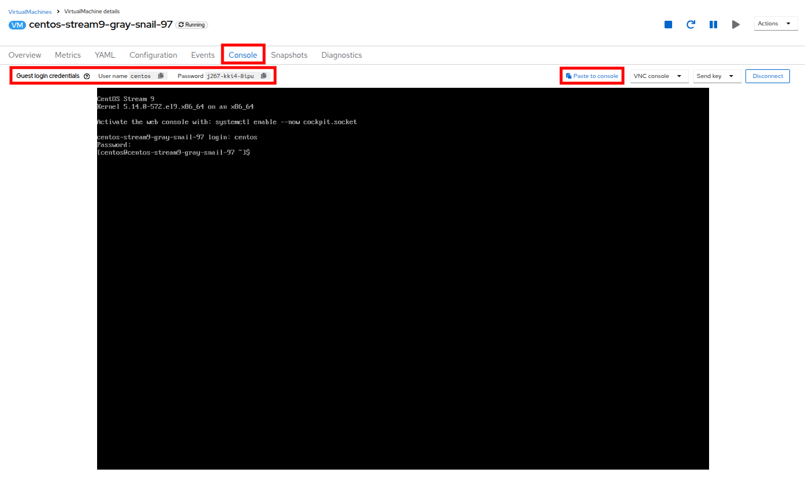
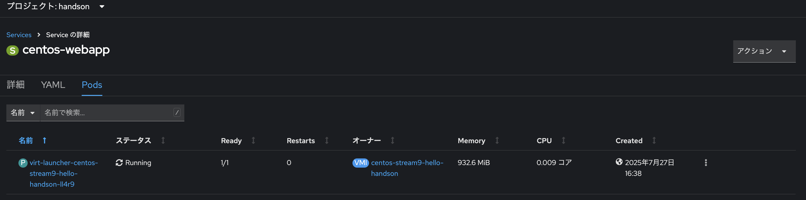

# 仮想マシンの作成

## はじめに

OpenShift Virtualization では、あらかじめ設定済みの仮想マシンテンプレートが `[Virtualization]` > `[Templates]` ページに一覧表示されます。これらは Red Hat Enterprise Linux、Fedora、CentOS、Microsoft Windows などのOSごとに用意されています。

Red Hat 提供のテンプレートには以下が含まれています：
- OSイメージ（起動元）
- OSの初期設定
- CPU/メモリの構成（フレーバー）
- ワークロードタイプ（例：サーバー）

その他のOS用テンプレートにはOSイメージは含まれませんが、推奨される構成がセット済みです。

### テンプレートの種類

テンプレートには以下の4種類があります。

| 種類 | 説明 |
|------|------|
| **Red Hat Supported** | Red Hat が完全サポートするテンプレート |
| **User Supported** | Red Hat のテンプレートをユーザーが複製して作成したもの |
| **Red Hat Provided** | Red Hat が限定的に提供するテンプレート |
| **User Provided** | Red Hat Provided をユーザーが複製したもの |


## 準備

1. 左メニューから `[Virtualization]` > `[VirtualMachines]` を開きます。
2. `[プロジェクトの作成]`ボタンを押下し、`handson` プロジェクトを作成します。


名前: `handson` を指定して、`[作成]`ボタンを押下してください。


## カタログから仮想マシンの作成

ここでは、登録済みの仮想マシンテンプレートを使用して、CentOS仮想マシンを起動します。

`[Virtualization]`画面にて、`[Catalog]`メニューを開きます。


そして、以下をそれぞれ指定してください。

- `① Select volume to boot from`: `centos-stream9`
- `② Select Instance Type`: `General Purpose - U series - medium: 1CPUs, 4GiB Memory` (デフォルトで選択されます)

OpenShift Virtualizationでは、仮想マシン構成の標準化のために `インスタンスタイプ` を使用できます。
これにより、クラウドのようにあらかじめ定義されたCPUやメモリ構成を簡単に選択できます。

    インスタンスタイプの例：
    - Nシリーズ：ネットワーク重視（DPDKなど）
    - Mシリーズ：メモリ重視
    - CXシリーズ：CPU強化
    - Oシリーズ：汎用＋メモリオーバーコミット
    - Uシリーズ：バランス型（一般向け）


- `③ VirtualMachine details`: `Name`にて、 `centos-stream9-hello-handson` を指定


最後に、`[Create Virtual Machine]`ボタンを押下してください。

すると、CentOS9仮想マシンの状態が`Running`になるはずです。

仮想マシンが起動したら、`[Console]`タブをクリックし、仮想マシンへログインしてみましょう。
> Note.  *Guest login credentials* にて、それぞれユーザ名とパスワードをコピーし、*Paste to console*をクリックすると、コピペできます。ブラウザから、クリックボードへのアクセスを許可してください。


おめでとうございます！
無事、OpenShift上に仮想マシンを展開することができました。

## テンプレートの複製とカスタマイズ

ここでは、登録済みの仮想マシンテンプレートをクローンし、カスタムの仮想マシンテンプレートを作成して仮想マシンを起動してみます。

利用する仮想マシンテンプレートは `CentOS9`で、Cloud-initでMariaDBを自動インストールします。


### プロジェクトを選択
左メニューから *Templates* をクリックし、プロジェクトとして `openshift` を選択してください。

   - 必要に応じて *Show default projects* を有効化します。
   - *openshift* プロジェクトを表示するには、*Show default projects* ボタンを切り替える必要があるかもしれません。


### centos9のテンプレートを検索

検索バーで `centos9` を検索し、`centos-stream9-server-small` を見つけます。


### カスタムテンプレートの作成
テンプレート名をクリックし、**Create a new custom Template** を選択します。


`Clone template` 画面で以下を入力し、`[Clone]`ボタンを押下してください。

- Template name: `centos-stream9-server-db-small`
- Project: `handson`
- Display name: `CentOS Stream 9 VM - Database Template Small`
- Provider: `OpenShift Virt Handson`

 

### CPUとメモリを編集
CPU と メモリを、CPU: 2, Memory: 4GiB　へ修正します。

`[Details]`タブをクリックし、詳細画面を表示します。


そして、`CPU|Memory`の箇所の鉛筆マークをクリックしてください。


### Cloud-initの編集

`[Scripts]`タブ > `[Cloud-init]` > `[Edit]` をクリックします。


`[Cloud-init]`ダイアログが開いたら、*Configure*の *Script* のラジオボタンをクリックし、以下の YAML スニペットで YAML を置き換えます。このスクリプトにより、VMの展開に合わせて、Cloud-initで、MariaDBのインストールと起動を自動化できます。

```
userData: |-
  #cloud-config
  user: centos
  password: ${CLOUD_USER_PASSWORD}
  chpasswd: { expire: False }
  packages:
    - mariadb-server
  runcmd:
    - systemctl enable mariadb
    - systemctl start mariadb
```


`[保存]`ボタンをクリックすると、*Saved* という緑色のプロンプトが表示されます。その後、*Apply* ボタンをクリックします。

### カタログからテンプレートを選択
左側のメニューにある `[Catalog]` をクリックし、 `[Template catalog]` オプションを選択してください。

そして、`[User templates]` を選択します。
すると、作成したテンプレートがタイルとして利用可能になっているはずです。


### テンプレートを使用した仮想マシンの作成

タイルをクリックすると、VMの起動画面が表示されます。 `[Quick create VirtualMachine]`（仮想マシンのクイック作成）ボタンをクリックします。


仮想マシンが起動すると、`[Overview]` ページに、テンプレートから作成され、定義した追加リソースが含まれていることがわかります。


このテンプレートには、`MariaDB`が含まれています。確認してみましょう。

### MariaDBへの接続確認
上部にある `[Console]` タブをクリックします。
提供された *Guest login credentials* と *Copy* および *Paste to console* ボタンを使用して、仮想マシンのコンソールにログインします。



仮想マシンにログインしたら、次のコマンドを実行してMariaDBのインストールをテストします。

```
sudo mysql -u root
```


VMからログアウトするには、*Ctrl-D* を2回押します。

## テンプレートからWindows VMを作成

続いて、Webサーバー上に提供されているISOを使用して、Microsoft Windows Server 2019をインストールしてみましょう。

本ハンズオンでは、sysprep済みの仮想マシンからクローンルートディスクを作成し、他のテンプレートで使用することで、OSの初期インストールを簡素化することができます。

> NOTE. テンプレートとして使用するゲストOSの準備プロセスは、状況によって異なります。テンプレートOSの準備の際には、必ず組織のガイドラインと要件に従ってください。

### テンプレートの選択
左側のメニューから `[Catalog]` に移動し、上部の `[Template catalog]` タブをクリックします。

検索バーに *win* と入力するか、または *Microsoft Windows Server 2019 VM* のタイルが見つかるまで下にスクロールします。


テンプレートに関連するデフォルト構成を示すダイアログが表示されます。

> NOTE. ブートソースが提供されていないため、このVMを素早く作成するオプションが初期状態では表示されません。VMをニーズに合わせてカスタマイズする必要があります。


### 必要情報の入力
ダイアログで以下を入力します

- *win-sysprep* という名前を指定します。

- *Boot from CD* のチェックボックスをオンにします。

- ドロップダウンメニューから *URL(creates PVC)*を選択します。

- *image URL* を指定します : https://catalog-item-assets.s3.us-east-2.amazonaws.com/qcow_images/Windows2019.iso

- CDディスクのサイズを *5 GiB* に縮小します。

- *Disk source* は *Blank* のままにし、サイズはデフォルト値の *60 GiB* に設定します

- *Mount Windows drivers dis* チェックボックスが有効になっていることを確認します。 **これは、VirtIO用のドライバを提供するWindowsシステムをインストールするために必要です。**


オプションを入力したら、テンプレートの設定を続けるために、下部の `[Customize VirtualMachine]` ボタンをクリックします。


### Boot Modeの変更
`[Customize and create VirtualMachine]` 画面で、`[Boot mode]` オプションの横にある編集用鉛筆アイコンをクリックします。 


`[Boot mode]` メニューが表示されたら、ドロップダウンメニューから `BIOSを選択し、 `[Save]` ボタンをクリックします。


### Sysprepを修正
`[Scripts]` タブをクリックし、 *Sysprep* セクションまでスクロールダウンし、 `[Edit]` ボタンをクリックします。


新しいウィンドウがポップアップし、新しいテンプレート用の *Sysprep* アクションを作成できます。


次のコードブロックを *Autounattend.xml* セクションにコピーして貼り付けます。

```
<?xml version="1.0" encoding="utf-8"?>
<unattend xmlns="urn:schemas-microsoft-com:unattend" xmlns:wcm="http://schemas.microsoft.com/WMIConfig/2002/State" xmlns:xsi="http://www.w3.org/2001/XMLSchema-instance" xsi:schemaLocation="urn:schemas-microsoft-com:unattend">
  <settings pass="windowsPE">
    <component name="Microsoft-Windows-Setup" processorArchitecture="amd64" publicKeyToken="31bf3856ad364e35" language="neutral" versionScope="nonSxS">
      <DiskConfiguration>
        <Disk wcm:action="add">
          <CreatePartitions>
            <CreatePartition wcm:action="add">
              <Order>1</Order>
              <Extend>true</Extend>
              <Type>Primary</Type>
            </CreatePartition>
          </CreatePartitions>
          <ModifyPartitions>
            <ModifyPartition wcm:action="add">
              <Active>true</Active>
              <Format>NTFS</Format>
              <Label>System</Label>
              <Order>1</Order>
              <PartitionID>1</PartitionID>
            </ModifyPartition>
          </ModifyPartitions>
          <DiskID>0</DiskID>
          <WillWipeDisk>true</WillWipeDisk>
        </Disk>
      </DiskConfiguration>
      <ImageInstall>
        <OSImage>
          <InstallFrom>
            <MetaData wcm:action="add">
              <Key>/IMAGE/NAME</Key>
              <Value>Windows Server 2019 SERVERSTANDARD</Value>
            </MetaData>
          </InstallFrom>
          <InstallTo>
            <DiskID>0</DiskID>
            <PartitionID>1</PartitionID>
          </InstallTo>
        </OSImage>
      </ImageInstall>
      <UserData>
        <AcceptEula>true</AcceptEula>
        <FullName>Administrator</FullName>
        <Organization>My Organization</Organization>
      </UserData>
      <EnableFirewall>false</EnableFirewall>
    </component>
    <component name="Microsoft-Windows-International-Core-WinPE" processorArchitecture="amd64" publicKeyToken="31bf3856ad364e35" language="neutral" versionScope="nonSxS">
      <SetupUILanguage>
        <UILanguage>en-US</UILanguage>
      </SetupUILanguage>
      <InputLocale>en-US</InputLocale>
      <SystemLocale>en-US</SystemLocale>
      <UILanguage>en-US</UILanguage>
      <UserLocale>en-US</UserLocale>
    </component>
  </settings>
  <settings pass="offlineServicing">
    <component name="Microsoft-Windows-LUA-Settings" processorArchitecture="amd64" publicKeyToken="31bf3856ad364e35" language="neutral" versionScope="nonSxS">
      <EnableLUA>false</EnableLUA>
    </component>
  </settings>
  <settings pass="specialize">
    <component name="Microsoft-Windows-Shell-Setup" processorArchitecture="amd64" publicKeyToken="31bf3856ad364e35" language="neutral" versionScope="nonSxS">
      <AutoLogon>
        <Password>
          <Value>R3dh4t1!</Value>
          <PlainText>true</PlainText>
        </Password>
        <Enabled>true</Enabled>
        <LogonCount>999</LogonCount>
        <Username>Administrator</Username>
      </AutoLogon>
      <OOBE>
        <HideEULAPage>true</HideEULAPage>
        <HideLocalAccountScreen>true</HideLocalAccountScreen>
        <HideOnlineAccountScreens>true</HideOnlineAccountScreens>
        <HideWirelessSetupInOOBE>true</HideWirelessSetupInOOBE>
        <NetworkLocation>Work</NetworkLocation>
        <ProtectYourPC>3</ProtectYourPC>
        <SkipMachineOOBE>true</SkipMachineOOBE>
      </OOBE>
      <UserAccounts>
        <LocalAccounts>
          <LocalAccount wcm:action="add">
            <Description>Local Administrator Account</Description>
            <DisplayName>Administrator</DisplayName>
            <Group>Administrators</Group>
            <Name>Administrator</Name>
          </LocalAccount>
        </LocalAccounts>
      </UserAccounts>
      <TimeZone>Eastern Standard Time</TimeZone>
    </component>
  </settings>
  <settings pass="oobeSystem">
    <component name="Microsoft-Windows-International-Core" processorArchitecture="amd64" publicKeyToken="31bf3856ad364e35" language="neutral" versionScope="nonSxS">
      <InputLocale>en-US</InputLocale>
      <SystemLocale>en-US</SystemLocale>
      <UILanguage>en-US</UILanguage>
      <UserLocale>en-US</UserLocale>
    </component>
    <component name="Microsoft-Windows-Shell-Setup" processorArchitecture="amd64" publicKeyToken="31bf3856ad364e35" language="neutral" versionScope="nonSxS">
      <AutoLogon>
        <Password>
          <Value>R3dh4t1!</Value>
          <PlainText>true</PlainText>
        </Password>
        <Enabled>true</Enabled>
        <LogonCount>999</LogonCount>
        <Username>Administrator</Username>
      </AutoLogon>
      <OOBE>
        <HideEULAPage>true</HideEULAPage>
        <HideLocalAccountScreen>true</HideLocalAccountScreen>
        <HideOnlineAccountScreens>true</HideOnlineAccountScreens>
        <HideWirelessSetupInOOBE>true</HideWirelessSetupInOOBE>
        <NetworkLocation>Work</NetworkLocation>
        <ProtectYourPC>3</ProtectYourPC>
        <SkipMachineOOBE>true</SkipMachineOOBE>
      </OOBE>
      <UserAccounts>
        <LocalAccounts>
          <LocalAccount wcm:action="add">
            <Description>Local Administrator Account</Description>
            <DisplayName>Administrator</DisplayName>
            <Group>Administrators</Group>
            <Name>Administrator</Name>
          </LocalAccount>
        </LocalAccounts>
      </UserAccounts>
      <TimeZone>Eastern Standard Time</TimeZone>
    </component>
  </settings>
</unattend>
```

コードを貼り付けたら、ダイアログの `[Save]` ボタンをクリックします。


### 仮想マシンの作成
画面の下部にある `[Create VirtualMachine]` ボタンをクリックします。


仮想マシンは、指定されたURLからISOイメージをダウンロードし、設定を行い、プロビジョニングされます。


本ハンズオンでは、起動用のISOイメージのダウンロードが必要なため、数分かかる場合があります。 `Diagnostics` タブをクリックすると、ダウンロードの進行状況を確認できます。


しばらくすると仮想マシンが起動し、ステータスが `Running` に変わります。 `[Console]`タブをクリックし、自動応答のインストールプロセスを表示します。


VMのインストールプロセスが完了したら（プロビジョニングには3～5分、起動と設定には約10分かかります）、`[停止]`ボタンで電源をオフにします。


### ルートボリュームのクローンを作成

VMを停止したら、今後、Windowsテンプレートによるインストールを行う際に、
毎回カスタマイズプロセスを実行することなく使用できる、ルートボリュームのクローンを作成します。

左側のメニューで `[ストレージ]` をクリックし、次に `[PersistentVolumeClaims]` をクリックすると、`handson` Project で利用可能な PVC のリストが表示されます。

インストールで作成された `win-sysprep` PVC を見つけ、右側の3点メニューから `[PVCのクローン]` を選択します。


ポップアップメニューで以下のオプションを入力し、*Clone*（クローン）ボタンをクリックします。
- *Name*: windows-2k19-sysprep-template
- *Access mode*:  共有アクセス (RWX) 
- *StorageClass*: ocs-storagecluster-ceph-rbd


クローンしたPVCが `Bound`されます。


### 再度Windows仮想マシンを作成してみる
`[Catalog]`メニューに戻り、以下を選択します。

`Disk source`: `PVC (clone PVC)`

`PVC name`: `Windows-2k19-Sysprep-Template`


`[Customize VirtualMachine]`ボタンをクリックして、ブートモードを `UEFI` ではなく `BIOS` に設定します。


BIOSを設定し、`[Create VirtualMachine]`（仮想マシンの作成）をクリックします。


しばらくすると、新しい `Windows Server 2019` 仮想マシンがクローン作成された PVC から起動します。


## 作成した仮想マシンへ外部からアクセスしてみる
### Service/Routeによるアプリケーションの公開

OpenShift上に展開された仮想マシンは、デフォルトで、OpenShiftのデフォルトのCNIである`OVN-Kubernetes`により自動的に払い出されたPodネットワークを`Primary Network`としてアタッチされます。
Primary Networkでは、同一のOpenShiftクラスタ内の仮想マシンや、他のPodと、Kubernetesの`Service`リソースで提供されるドメインで名前解決し、接続することが可能です。

また、OpenShiftでは、`Route`と呼ばれるHA proxyベースのL7ロードバランサが提供されます。仮想マシン上の特定のサービスへ80/443で接続したい場合は、その他のPodと同様、Routeを経由して接続できます。

ここでは、本章の一番最初に作成したCentOSの仮想マシンへ`nginx`をインストールし、*Service* と *Route* を使用してアクセスできることを確認します。

### 仮想マシンへnginxのインストール
本章で作成した`centos-stream9-hello-handson`の `[Console]`を開きます。


仮想マシンへログインして、以下のコマンドを実行して`nginx`をインストールしてください。

```
sudo dnf -y install nginx
```

`nginx`をインストールできたら、サービスを起動しておきます。

```
sudo systemctl enable nginx --now
sudo systemctl status nginx
```


### Service
KubernetesのServiceリソースは、様々な`type`を利用できます。
以下に簡単に利用できる`type`をまとめます。

| 種類 | 説明 |
|------|------|
| **ClusterIP** | クラスタ内部（Pod間）の通信に使用される仮想IPを提供(デフォルト) |
| **Node Port** | 各ノードに固定ポート（30000〜32767）を割り当て、ノードのIP＋ポートで外部からアクセス |
| **LoadBalancer** | クラウドプロバイダが提供するL4ロードバランサを作成し、外部IPを自動割り当て |
| **ExternalName** | DNS名を返すだけの特殊なService。外部サービスへの名前解決用として使用 |
| **Headless** | `ClusterIP: None` を指定することで作成される特殊なClusterIP Service |

### Serviceの作成

左側のメニューで *ネットワーク* を展開し、*Services* をクリックします。読み込まれた画面で、画面の隅にある *[Serviceの作成]* ボタンをクリックします。


YAMLを以下に置き換えます。

```
apiVersion: v1
kind: Service
metadata:
  name: centos-webapp
  namespace: handson
spec:
  type: ClusterIP
  selector:
    vm.kubevirt.io/name: centos-stream9-hello-handson
  ports:
  - protocol: TCP
    port: 80
    targetPort: 80
```


画面下部の *[保存]* ボタンをクリックします。 YAML が保存されたという通知が表示されます。

作成された `centos-webapp`Serviceの画面にて、[Pods]タブを開くと、トラフィックを転送する先のPodが表示されていることを確認してください。



*Service* を作成したことで、`centos-stream9-hello-handson` VM上のnginx サーバーは OpenShift クラスター内からアクセスできるようになりました。
他の仮想マシンは、Service名 + ネームスペース名から決定される DNS 名 **centos-webapp.handson.svc.cluster.local** を使用して、`centos-stream9-hello-handson` VM上のnginxサービスにアクセスできます。

### Routeの作成
nginxサービスへ外部からアクセスできるようには *Route* を使用してパブリックに公開することで実現できます。

*ネットワーク* の下で、左側のナビゲーションメニューの *Routes* オプションをクリックします。 画面中央の *Create Route* ボタンをクリックします。


. 以下の情報を使用してフォームに入力し、一番下までスクロールして、完了したら *Create* をクリックします。

- *Name*: *handson*
- *Service*: *centos-webapp*
- *Target port*: *80 -> 80 (TCP)*
- *Secure Route*: *Enabled*
- *TLS termination*: *Edge*
- *Insecure traffic*: *Redirect*


入力したら、 `[作成]`ボタンを押下します。
作成ボタンを押下後に表示される画面の`場所`という箇所にドメインが表示されています。


このドメインへアクセスすると、自己証明書を利用しているため、セキュリティ警告画面が表示されます。
`[詳細設定]`を押下し、`....にアクセスする（安全ではありません）`のリンクを開くと、以下の画面が表示されるはずです。


## 5. ライブマイグレーション
本章の最後に、仮想マシンのライブマイグレーションを試してみましょう。
`VirtualMachines`メニューを開き、作成済みの`centos-stream9-hello-handson`という名前のVMの詳細画面を開きます。


`[Actions]`をクリックして、`[Migration]` > `[Compute]`をクリックします。


`General`に表示されているNode名に着目してください。この例では、`ip-10-0-28-29...`という名前が表示されています。


少し待つと、`Status`へ`Migrating`と表示されます。


すぐに `Running`へ戻り、`General`に表示されているNode名が変わったことを確認できます。

