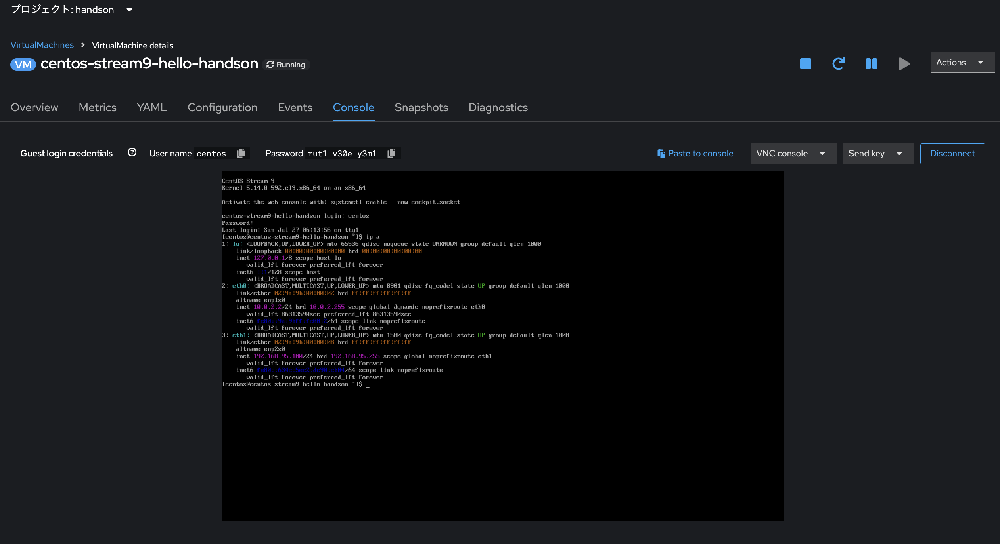

# 仮想マシンのネットワーク管理

## はじめに

2章で述べたように、すべての仮想マシンはデフォルトで OpenShiftの提供するSDNに接続されています。
このSDNを *Primary Network*と呼びます。

Primary Networkにより、展開した仮想マシンは、OpenShift クラスタ上の他の仮想マシンやコンテナからのアクセスが可能になり、仮想マシンと仮想マシン上に起動するアプリケーションを、より近代的な方法で管理できるようになります。

* SDN は、クラスタ内で VM または Pod としてデプロイされたアプリケーションを、抽象化、接続、公開するための追加機能を提供します。これには、OpenShift の *Service* および *Route* 機能が含まれます。
* OpenShift のネットワークポリシーエンジンにより、VM のユーザーまたは管理者は、個々の VM または *Project* / *Namespace* 全体に対するネットワークトラフィックを許可または拒否するルールを作成することができます。

しかし、必要に応じて仮想マシンをタグなしネットワークや VLAN などの 1 つ以上の物理ネットワークに直接接続したいユースケースもあるでしょう。

OpenShift Virtualizationは、この要件に対し、*Secondary Network*　として、Linux ブリッジなどのホストネットワークの設定によって、仮想マシンをSDNとは異なるネットワークへ接続する機能を提供します。

この機能は、SDN に加えて行われるもので、例えば、管理者は外部 IP アドレスから VM に接続でき、VM はレイヤー2 ネットワークを使用して直接接続できます。

本トピックでは、VM をブリッジ接続し、物理ネットワークに直接接続できるようにするための *Network Attachment Definition* を作成する手順を説明します。

## Kubernetes NMState Operatorのインストール
仮想マシンを Secondary Networkへ接続するには、*Kubernetes NMState Operator*が必要です。

*Kubernetes NMState Operator* は、NMState を使用して OpenShift Container Platform クラスタのノード全体でステート駆動型のネットワーク構成を実行するための Kubernetes API を提供します。 

Kubernetes NMState Operator は、クラスタノード上のさまざまなネットワークインターフェースタイプ、DNS、ルーティングを構成するための機能を提供します。さらに、クラスターノード上のデーモンが、各ノードのネットワークインターフェースの状態を定期的にAPIサーバーに報告します。

本ハンズオン環境には、NMState Operatorがインストールされています。そのため、まずは、NMState Operatorをインストールすることから始めましょう。

`[管理者向け表示]` > `[Operator]` > `[OperatorHub]`を開き、検索ボックスへ `NMState`と入力します。


そして、`[インストール]`ボタン を続けて押下し、NMState Operatorをインストールします。


インストールボタンを押下後、`[インストール済みのOperator]`画面で、`Kubernetes NMState Operator`の状態が`Succeeded`になるまで待ちましょう。


状態が`Succeeded`になったら、`Kubernetes NMState Operator`を開き、`[NMState]`の`インスタンスの作成`をクリックします。


そして、デフォルトの設定のまま`[作成]`ボタンを押下してください。

`[ホーム]` > `[概要]`の`クラスタインベントリ`にて、作成中のPodが存在しなくなるまで待ちましょう。


左側のメニューで `[Virtualzation]` > `Networking` をクリックし、次に `NodeNetworkState` > `[Expand all]` をクリックして現在のノード上のネットワーク構成を確認します。


現状は、Primary Networkを提供するための デフォルトの OVSブリッジとインタフェースのみが存在します。

## NodeNetworkConfigurationPolicyの作成

ノード上に新たなネットワーク構成を追加するには、`NodeNetworkConfigurationPolicy`を作成します。

### ノードラベルの追加

`NodeNetworkConfigurationPolicy`を適用するノードは、ラベルを元に選択されます。
1章で追加したベアメタルインスタンスのみに、`NodeNetworkConfigurationPolicy`を適用するために、ベアメタルインスタンスを識別するためのラベルを追加しておきましょう。

`[管理者向け表示]` > `[コンピュート]` > `[ノード]`を開き、インスタンスタイプが`c5n.metal`のノードの メニューをクリックして、`[ラベルの編集]`を開きます。


`node-type=baremetal`というラベルを入力して、`[Enter]`した後、 `[保存]`ボタンを押下してください。


> Note. 1章にて、c5n.metalのノードを2台追加しているため、もう一台に対しても同様の手順でラベルを追加してください。


### NodeNetworkConfigurationPolicyの作成

`[ネットワーク]` > `[NodeNetworkConfigurationPolicy]`を選択し、`[Create]`ボタンを押下します。そして、以下の情報を入力してください。


`Apply this NodeNetworkConfigurationPolicy only to specific subsets of nodes using the node selector`をチェックし、`Add Label`をクリックの上、`Key`: `node-type`、`Value`: `baremetal`を入力し、`[Save]`ボタンを押下します。


続いて、以下の項目を入力し、`[Create]`ボタンを押下します。

- Policy name: `create-br0-static`
- Interface name: `br0`
- Network state: `Up`
- Type: `Linux bridge`
- `IPv4`へチェック
  - IPV4 address: `192.168.95.1`
  - Prefix length: `24`
- Port: 無し

`[Create]`ボタンを追うと、`Enactment states`が`Progressing`となります。
正常に対象の2ノードへの設定が反映されると、`2 Available`へ遷移します。


`NodeNetworkState`を開き、`Expand all`ボタンを押下して、ノードのネットワーク設定の状態を確認してみましょう。以下のように、ベアメタルインスタンスにのみ、`linux-bridge`: `br0`が作成されているはずです。


## Network Attachment Definitionの作成

VMでLinuxブリッジを使用するには、*Network Attachment Definition* を作成する必要があります。これは、OpenShiftにネットワークを通知し、仮想マシンがネットワークに接続できるようにするものです。

*Network Attachment Definition* はプロジェクトに紐づいており、そのプロジェクトにデプロイされた仮想マシンだけがアクセスできます。 Network Attachment Definitionがデフォルトのプロジェクトに作成された場合、グローバルに利用可能になります。 これにより、管理者は、VMを管理するアクセス権を持つ特定のユーザーに対して、どのネットワークを利用可能にするか、または利用不可能にするかを制御することができます。

左側のメニューから `[ネットワーク]` > `[Network Attachment Definition]` の順に選択します。

そして、`handson` プロジェクトへ切り替えた上で、`[Create Network Attachment Definition]` をクリックします。

以下の情報を入力し、`[作成]`ボタンを押下してください。

* *Name*: nad-br0
* *ネットワークタイプ*: Linux Bridge
* *ブリッジ名*: br0


> IMPORTANT: Network Attachment Definitionを作成する際には、`handson`プロジェクト内であることを確認してください。

> NOTE. 上記のフォームには、VLAN タグ番号を入力するフィールドがあります。これは、VLAN タグの割り当てが必要なネットワークに接続する場合に使用します。今回は、タグなしネットワークを使用しているため、VLAN 番号は必要ありません。

> NOTE. ホスト上の単一のLinuxブリッジには、多くの異なるVLANを関連付けることができます。このシナリオでは、個々のNetwork Attachment Definitionを作成するだけでよく、個別のホストインターフェースやブリッジを作成する必要はありません。

## 仮想マシンをネットワークに接続
左側のメニューで `[Virtualization]`画面へ切り替えて、`[VirtualMachines]` に移動し、中央の列から *centos-stream9-hello-handson* VM を選択します。 `[Configuration]` タブをクリックし、左側の `[Network]` タブをクリックします。


`[Add network interface]`ボタン をクリックし、表示されるフォームに必要事項を入力して、*保存* をクリックします。

- Name: `internal-handson`
- Model: `virtio`
- Network: `handson/nad-br0`


VM起動中にネットワークを追加した場合は、追加したネットワークが`Pending`となります。画面右上の再起動ボタンをクリックして、VMを再起動しましょう。


続いて、`Console`タブを開き、VMにログインします。
VM側に特に追加のネットワーク設定を入れてないため、以下の通り、手動で追加されたNICへIPアドレスを割り当てます。

```
sudo nmcli c modify 'Wired connection 1' ipv4.method manual ipv4.address 192.168.95.100/24 ipv4.gateway 192.168.95.1
sudo nmcli c up 'Wired connection 1'
ip a
```




`br0`に割り当てられた`192.168.95.1`へpingできることを確認しましょう。

```
ping 192.168.95.1
```

## User Defined Network

`User Defined Network（UDN）`の実装前は、OpenShiftのCNIプラグインである`OVN-Kubernetes` は、プライマリまたはメインネットワーク上のレイヤー3トポロジーのみをサポートしていました。

Kubernetesの設計原則により、すべてのPodはメインネットワークに接続され、すべてのPodはIPアドレスを使用して相互に通信し、Pod間のトラフィックはネットワークポリシーに従って制限されます。新しいネットワークアーキテクチャを学ぶことは、多くの従来の仮想化管理者からしばしば表明される懸念事項です。

UDNの導入により、カスタムのレイヤ2、レイヤ3、ローカルネットのネットワークセグメントが有効になり、KubernetesのPod Networkのデフォルトのレイヤ3トポロジーの柔軟性とセグメント化機能が向上します。

これらのセグメントは、デフォルトのOVN-Kubernetesを使用するコンテナや仮想マシンに対し、プライマリまたはセカンダリネットワークとして機能します。

また、UDNは、幅広いネットワークアーキテクチャとトポロジーを可能にし、ネットワークの柔軟性、セキュリティ、およびパフォーマンスを向上させます。

クラスタ管理者は、`ClusterUserDefinedNetwork`カスタムリソース（CR）を活用することで、UDNを使用してクラスタレベルで複数の *Namespace* にまたがる追加のネットワークを作成および定義できます。さらに、クラスタ管理者またはクラスタユーザーは、UserDefinedNetwork CRを使用して、*Namespace*レベルで追加のネットワークを定義するためにUDNを使用できます。

User Defined Networkには、以下の利点があります。

- **セキュリティ強化のためのネットワーク分離** - Namespace は、独自の分離されたプライマリネットワークを持つことができます。これにより、テナント間のトラフィックのリスクが低減され、セキュリティが向上します。
- **ネットワークの柔軟性** - クラスタ管理者は、プライマリネットワークをレイヤー2またはレイヤー3のネットワークタイプとして構成できます。これにより、プライマリネットワークにセカンダリネットワークの柔軟性が提供されます。
- **簡素化されたネットワーク管理** - User Defined Networkにより、異なるネットワークでワークロードをグループ化することで分離が実現できるため、複雑なネットワークポリシーの必要性がなくなります。
- **高度な機能** - User Defined Networkにより、管理者は複数のNamespace を単一のネットワークに接続したり、異なるNamespaceのセットごとに個別のネットワークを作成したりすることができます。 また、ユーザーは異なるNamespaceやクラスターにまたがって IP サブネットを指定し、再利用することもでき、一貫したネットワーク環境を提供します。

### OpenShift VirtualizationによるUser Defined Network

OpenShift のウェブコンソールまたは CLI を使用して、仮想マシンのプライマリインターフェイス上のUDNに仮想マシンを接続することができます。

プライマリUDNは、指定した Namespace のデフォルトのPod Networkに置き換わります。Pod Networkとは異なり、プライマリ UDN はプロジェクトごとに定義でき、各プロジェクトは固有のサブネットとトポロジーを使用できます。

レイヤー2トポロジーでは、OVN-Kubernetesはノード間にオーバーレイネットワークを作成します。このオーバーレイネットワークを使用すると、追加の物理ネットワークインフラストラクチャを構成することなく、異なるノード上のVMを接続することができます。

レイヤー2トポロジーでは、ライブマイグレーション時に永続的なIPアドレスがクラスターノード全体で保持されるため、NATを必要とせずにVMのシームレスなマイグレーションが可能です。

プライマリUDNを実装する前に、以下の制限事項を考慮する必要があります。

- virtctl ssh コマンドを使用して VM への SSH アクセスを構成することはできません。
- oc port-forward コマンドを使用して VM へのポート転送を行うことはできません。
- Headlessサービスを使用して VM にアクセスすることはできません。
- VM の健全性チェックを構成するためのReadinessおよびLivenessのプローブを定義することはできません。

> NOTE: OpenShift Virtualization は現在、セカンダリUser Defined Networkをサポートしていません。

### User Defined Networkの使用

UDNにアクセスできるPodを作成する前に、Namespace とネットワークを作成する必要があります。Podを新しいネットワークにNamespaceを割り当てることや、既存のNamespaceにUDNを作成することは、OVN-Kubernetesでは受け付けられません。

この作業はクラスタ管理者によって実行する必要があります。

ここでは、`handson-udn` というNamespaceを作成します。
また、`handson-udn` namespaceへ、適切なラベル（*k8s.ovn.org/primary-user-defined-network*）を割り当てる必要があります。

踏み台サーバ上で以下を実行してください。
```
[lab-user@bastion ~]$ cat << EOF | oc apply -f -
apiVersion: project.openshift.io/v1
kind: Project
metadata:
  name: handson-udn
  labels:
    k8s.ovn.org/primary-user-defined-network: ""
EOF
```

OpenShiftコンソール上の`[Virtualization]`画面にて、`[Network]`メニュー に移動し、`[User Defined Network]` をクリックします。

ここで、プロジェクト *handson-udn* が選択されていることを確認し、


`[作成]`ボタン をクリックし、 *UserDefinedNetwork* を選択します。


サブネット *192.168.254.0/24* を指定し、 `[作成]`ボタン をクリックします。


作成したUDNの設定を確認します。
`handson-udn` Projectに、`primary-udn`が作成されたことを確認します。


* フォームを使用して作成した場合のデフォルト名は *primary-udn* です。
* デフォルトではレイヤー2です（現時点でOpenShift仮想化でサポートされている唯一のレイヤー）。
* 役割はプライマリです（仮想マシンは現時点ではプライマリネットワークのみを使用できます）。
* Network Attachment Definitionは自動的に作成されます。

次に、左側のメニューで *NetworkAttachmentDefinitions* に移動し、関連するNADが自動的に作成されていることを確認します。


### UDNと接続する仮想マシンの作成
UserDefinedNetworkに接続された仮想マシンを作成するには、 [YAML定義の調整](https://docs.redhat.com/en/documentation/openshift_container_platform/4.18/html/virtualization/networking#virt-connecting-vm-to-primary-udn) が必要です。

このハンズオンでは作業を簡単にするため、以下のYAML定義を使用し、UserDefinedNetworkに接続されたVMを作成します。

次の画像のように、トップメニューを使用してYAMLをインポートできます。


```
apiVersion: kubevirt.io/v1
kind: VirtualMachine
metadata:
  labels:
    kubevirt.io/vm: fedora-udn
  name: fedora-udn
  namespace: handson-udn
spec:
  dataVolumeTemplates:
    - apiVersion: cdi.kubevirt.io/v1beta1
      kind: DataVolume
      metadata:
        creationTimestamp: null
        name: fedora-udn
      spec:
        sourceRef:
          kind: DataSource
          name: fedora
          namespace: openshift-virtualization-os-images
        storage:
          resources:
            requests:
              storage: 30Gi
  runStrategy: Always
  template:
    metadata:
      name: fedora-udn
      namespace: handson-udn
    spec:
      domain:
        devices:
          disks:
          - disk:
              bus: virtio
            name: rootdisk
          - disk:
              bus: virtio
            name: cloudinitdisk
          interfaces:
          - name: primary-udn
            binding:
              name: l2bridge
          rng: {}
        resources:
          requests:
            memory: 2048M
      networks:
      - pod: {}
        name: primary-udn
      terminationGracePeriodSeconds: 0
      volumes:
      - dataVolume:
          name: fedora-udn
        name: rootdisk
      - cloudInitNoCloud:
          userData: |-
            #cloud-config
            user: fedora
            password: fedora
            chpasswd: { expire: False }
        name: cloudinitdisk
```

貼り付けが完了したら、画面下部の青い `[作成]` ボタンをクリックしてVMの作成プロセスを開始します。

`[VirtualMachines]` に切り替えて、VM が作成されるのを見ます。 作成されたら、新たに作成された *fedora-udn* 仮想マシンを確認します。 


`[Overview]` タブの `[Network]` タイルに、UDN から割り当てられた IP が表示されます。


コンソールタブに切り替えて、提供されたゲスト認証情報を使用してVMにログインします。 


VM上で、以下のコマンドを実行すると、定義されたサブネットからIPが割り当てられていることがわかります。

```
ip a
```


また、VMはUDNを使用してインターネットにアクセスできます。

```
ping 8.8.8.8
```


## まとめ

本章では、物理ネットワークの操作と、仮想マシンを既存のネットワークに直接接続する方法について体験しました。

仮想マシンを物理ネットワークに直接接続することで、管理者は仮想マシンに直接アクセスできるだけでなく、仮想マシンをストレージネットワークや管理ネットワークなどの専用ネットワークに接続することも可能になります。

`User Defined Network(UDN)`は、クラスタ管理者やエンドユーザーに高度なカスタマイズが可能なネットワーク構成オプションを提供し、プライマリおよびセカンダリネットワークの両方をより柔軟に管理することができます。