# ストレージ管理

Red Hat OpenShift は、オンプレミスおよびクラウドプロバイダーの両方で、複数の種類のストレージをサポートしています。OpenShift Virtualizationは、ワークロードが実行されている環境でサポートされているコンテナストレージインターフェイス（CSI）プロビジョナーを使用できます。

物理ストレージシステムの例としては、Dell/EMC、富士通、日立、NetApp、Pure Storage などがあります。

ソフトウェア定義ストレージの例としては、IBM Fusion Data Foundation、OpenShift Data Foundation (ODF)、Portworx などがあります。 

>サポート対象のストレージソリューションについては [Red Hat EcoSystem Catalog](https://catalog.redhat.com/platform/red-hat-openshift/virtualization#virtualization-infrastructure) を参照してください。

本章では、VMディスクを保存するために使用されるPVC（Persistent Volume Claim）について説明します。

多くのストレージプロバイダーは、デバイスのスナップショットやクローンもサポートしています。CSIドライバーとストレージデバイスがサポートする機能については、必ずベンダーに確認してください。

OpenShift Virtualization固有のストレージプロトコル（NFS、iSCSI、FCなど）に関する制限はありません。唯一の要件は、クラスタ内のVMのライブマイグレーションをサポートするために必要な *RWXアクセスモード* が利用可能であることです。

Red Hat OpenShift でストレージをプロビジョニングする際の CSI ワークフローについては、以下の図を参照してください。


## 事前準備
### 仮想マシンの作成
`[Virtualization]` パースペクティブを開き、`handson` プロジェクト内で `[Create VirtualMachine]` ボタンをクリックし、ドロップダウンメニューから `[From template]` を選択します。
>VM は、InstanceType ウィザードから作成することも、カスタムの YAML 定義を入力して作成することもできますが、今回のラボのシナリオでは、既存のテンプレートをベースとした VM の作成に限定します。

カタログ画面に移動し、利用可能な事前定義のVMテンプレートを示す多数のタイルが表示されます。

>利用可能なテンプレートのリストを確認すると、一部に青いバッジが付いているものがあることに気づくでしょう。これは、自動的にダウンロードされ保存されたテンプレートソースディスクを使用しているテンプレートであることを示しています。 
>利用可能なオプションをカスタマイズできる環境で展開している場合は、これらのブートソースのデフォルトでの可用性を変更したり、これらのソースディスクを削除したりすることができます。


`[Fedora VM]` タイルを選択すると、ダイアログが開きます。

名前を *fedora01* に変更し、`[Quick create VirtualMachine]` をクリックします。


VMステータスが `Provisioning` から `Starting` に変わり、準備が整うと `Running` に変わります。

この間、ストレージプロバイダはテンプレートディスクを複製し、新しく作成された仮想マシンで使用できるようにしています。この処理にかかる時間は、ブートディスクの作成に使用するストレージプロバイダや、システムの現在の負荷によって異なります。

仮想マシンが起動したら、右側の列にある *Overview* ページでさらに詳しく調べることができます: 

* **Details**：このタイルには、VM の名前、ステータス、作成時間、OS、仮想リソース、および作成元のテンプレートなど、VM に関する情報が表示されます。また、VNC 端末の縮小版と、フルスクリーン Web コンソールを起動する機能も含まれています。

* **General**：このタイルには、ゲストが実行されている Namespace (プロジェクト)、インスタンス名、および Kubernetes Podなど、OpenShift 固有の情報が表示されます。

* **Snapshots**: このタイルでは、既存のスナップショットに関する情報を表示し、スナップショットをすばやく作成するためのボタンも表示されます。

* **Network**: このタイルでは、ソフトウェア定義ネットワーク（SDN）上の仮想マシンのIPアドレスと内部ホスト名が表示されます。高度なネットワークが定義されていない場合、VMは自動的にPodネットワークに接続されます。このラボの後半では、高度なネットワークオプションと、VMの接続性をカスタマイズする方法について説明します。

* **Utilization**: このタイルでは、CPU、メモリ、ストレージ、ネットワークスループットなど、現在この仮想マシンで使用中のリソースの概要が表示されます。


## VM の PVC を確認する

本章は、先ほど作成した仮想マシン *fedora01* のバックエンドストレージを詳しく見ていきます。

左側のメニューで `[Storage]` -> `[Persistent Volume Claims]` をクリックして開始します。 `handson` ネームスペースにいることを確認してください。前のセクションで *fedora01* 仮想マシンを作成したときに作成された *fedora01* PVCが表示されるはずです。

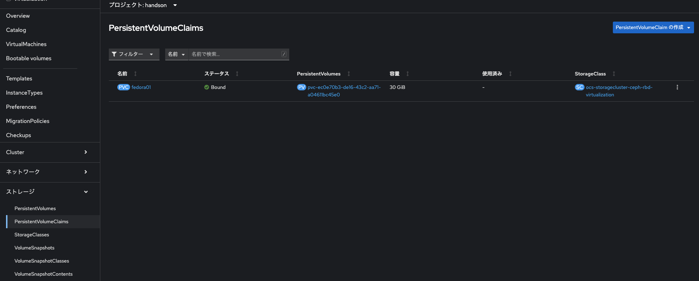

*fedora01* PVCをクリックすると、VMをバックアップするストレージボリュームに関する追加の詳細情報が表示されます。

永続ボリュームの主張に関する以下の情報に注目してください:
- PVCは現在、正常にバインドされています
- PVCは30GiBの容量とサイズを要求しています
- PVCのアクセスモードはReadWriteMany (RWX) です
- PVCのボリュームモードはBlockです
- ボリュームは *ocs-storagecluster-ceph-rbd-virtualization* ストレージクラスを使用しています。

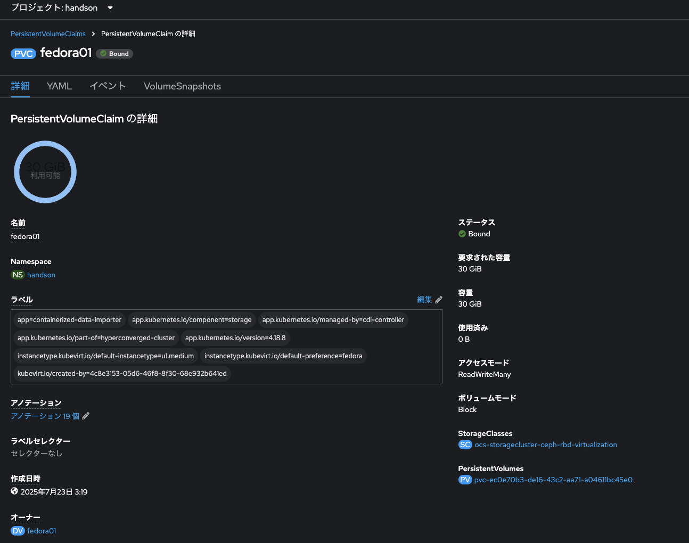

## スナップショットの管理

OpenShift Virtualizationは、仮想マシンのディスクスナップショットを作成するために、CSIストレージプロバイダーのスナップショット機能に依存しています。

スナップショットは、VMが実行中の場合は「オンライン」で、VMの電源がオフの場合は`オフライン`で取得できます。
VMにKVM統合パッケージ（qemu-tools）がインストールされている場合、ゲストOSを自動的に静止させるオプションも利用できます。

> 静止により、ディスクのスナップショットがゲストファイルシステムの整合性のある状態を確実に反映します。例えば、バッファがフラッシュされ、ジャーナルが整合性のある状態になります。

ディスクのスナップショットは、CSIによって抽象化されたストレージ実装に依存するため、パフォーマンスへの影響と使用容量はストレージプロバイダによって異なります。ストレージベンダーと協力して、システムがPVCスナップショットをどのように管理するか、また、期待されるパフォーマンスにどのような影響があるか（または影響がないか）を判断してください。

>IMPORTANT. スナップショットは、通常、元の物理ボリュームと同じストレージシステム上にローカルに保存されるため、それ自体ではバックアップや災害復旧機能を提供しません。真の災害から生き延びるためには、データを別の方法で保護する必要があります。例えば、1つ以上のコピーを別の場所に保存したり、ストレージシステム自体の故障を回避するために、リモートロケーションのストレージシステムにミラーリングしたりします。

VMスナップショット機能により、クラスタ管理者およびアプリケーション開発者は、以下の操作を行うことができます:

* 新しいスナップショットの作成
* 特定のVMにアタッチされたすべてのスナップショットのリスト表示
* VMをスナップショットに復元
* 既存のVMスナップショットを削除

### スナップショットの作成と使用

`[Virtualization]` パースペクティブドロップダウンに戻り、左側のメニューで `[VirtualMachines]` をクリックします。 中央列のプロジェクト *handson* を展開し、*fedora01* 仮想マシンをハイライトします。

現在、このVMのスナップショットは概要ページに表示されていないことに注意してください。


ページ上部の `[Snapshots]` タブに移動します。

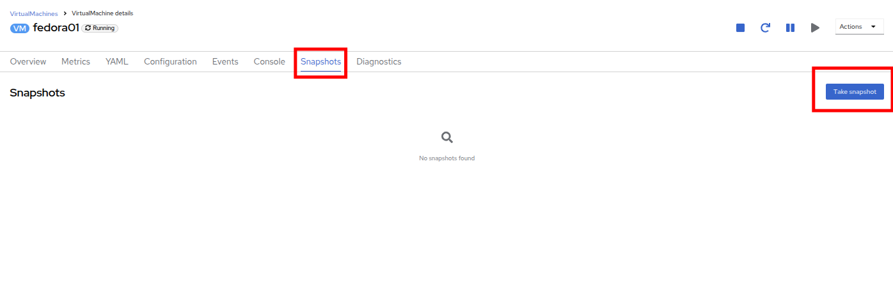

`[スナップショットの取得]` をクリックすると、ダイアログが開きます。

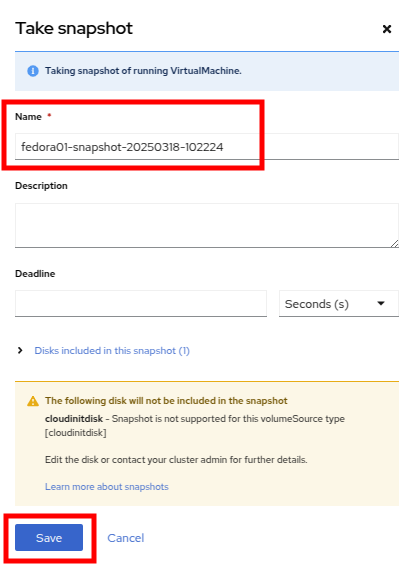

>*cloudinitdisk* がスナップショットに含まれないという警告が表示されます。これは初期ブートに使用される一時的なディスクであるため、想定される動作です。

スナップショットには自動的に名前が生成されます。 `[Save]` をクリックし、ステータスが `Operation complete` と表示されるまで待ちます。

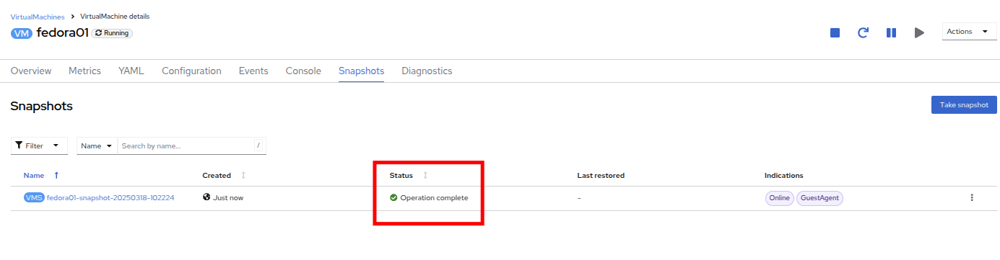

3点のドットメニューをクリックし、VMが現在実行中であるため、`Restore` オプションがグレー表示されていることを確認します。


次に、`[Console]` タブに切り替えます。ログインして、VMが起動できないように変更を加えます。


>*User name* と *Password* の両方の隣にコピーアイコンがあり、*Paste to console* (コンソールに貼り付け)ボタンも利用可能です。

ログイン後、次のコマンドを実行します。

```
sudo rm -rf /boot/grub2; sudo shutdown -r now
```

実行すると、仮想マシンは自動的に再起動しますが、正常に起動することはできなくなります。

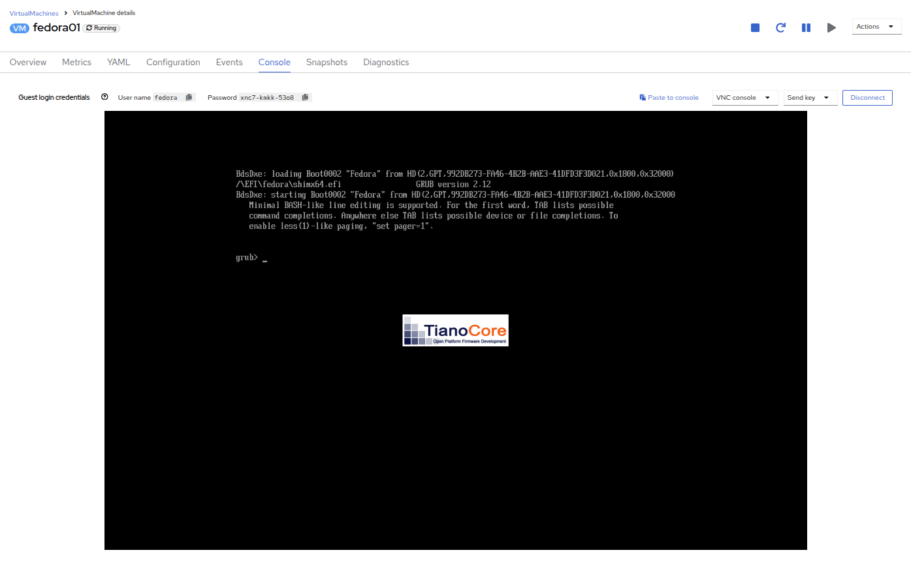

>IMPORTANT. 前のステップでは、ゲスト内でOSをシャットダウンしました。しかし、VMをホストしているPodがまだ実行中であるため、OpenShift仮想化はデフォルトでポリシーに基づいて自動的に再起動します。この動作は、グローバルまたはVMごとに変更できます。

右上の `Actions` ドロップダウンメニューまたはショートカットボタンを使用して、VMを *Stop* します。 このプロセスは、マシンが不安定な状態にあるため、正常なシャットダウンを試みるため、時間がかかる場合があります。`Actions` ドロップダウンメニューを再度クリックすると、*Force stop* オプションが表示されます。 ラボを継続するには、このオプションを使用してください。

`[Overview]` タブをクリックして、VM が停止したことを確認できます。 また、先ほど取得したスナップショットが `[Snapshot]` タイルに表示されていることも確認できます。 

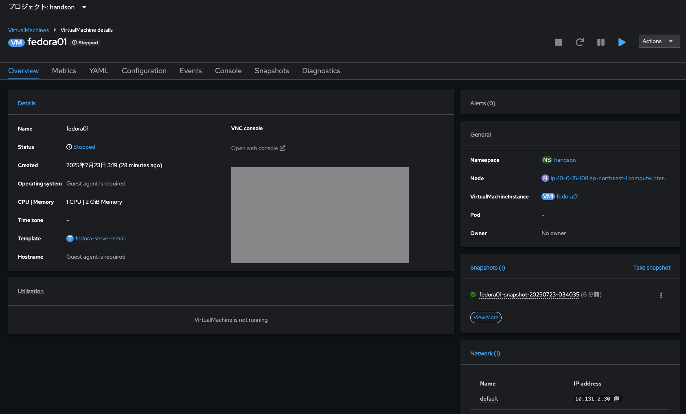

`[Snapshot]` タイルで、当社のスナップショットの横にある3つのドットのメニューをクリックします。VMが停止している状態で、`Restore` がグレー表示ではなくなります。クリックします。

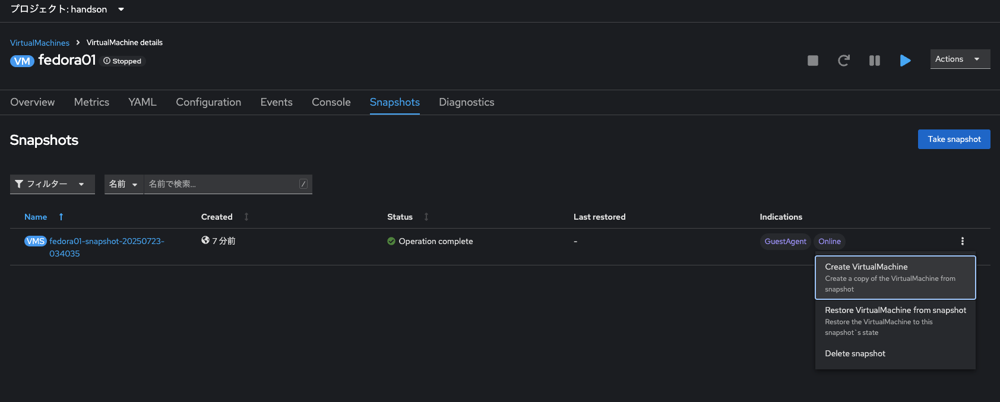

表示されるダイアログで `[Restore]` をクリックします。

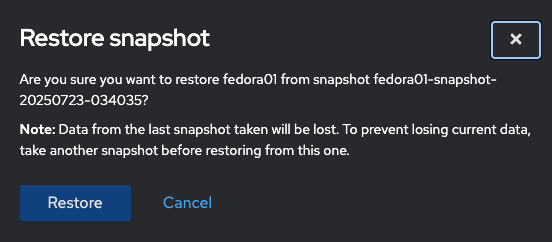

VM が復元されるまで待ちます。このプロセスはかなり速く完了します。

上部にある `[Snapshots]` タブをクリックすると、直近の復元操作の詳細を確認できます。

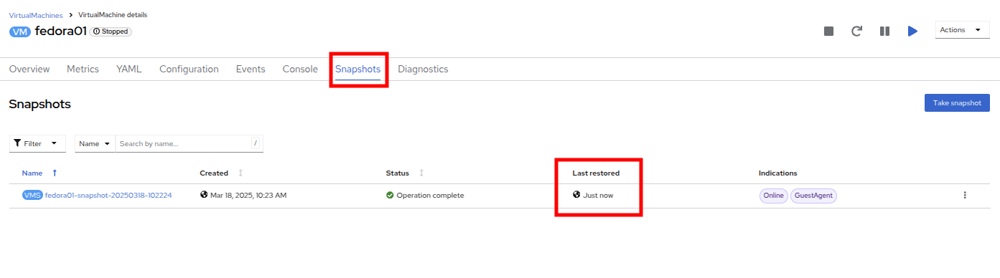

`[Overview]` タブに戻り、VM を起動します。

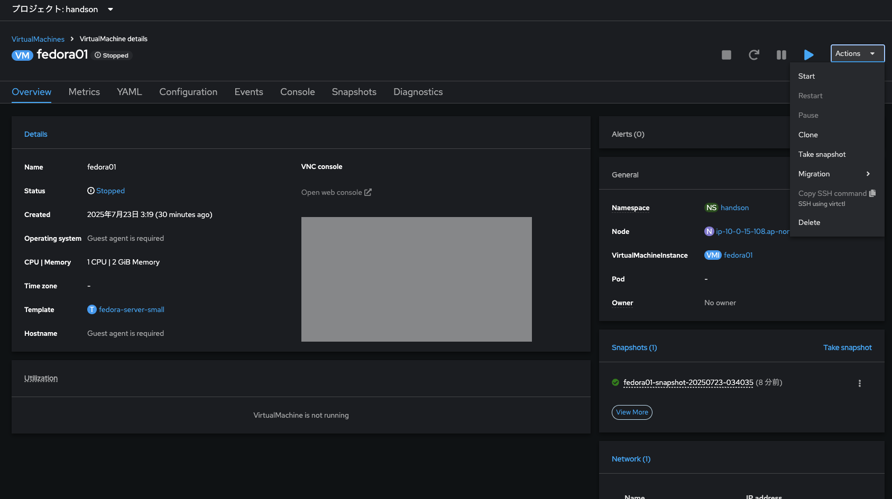

`[Console]` タブをクリックして、VM が再起動し、OS に正常にブートアップしたことを確認します。

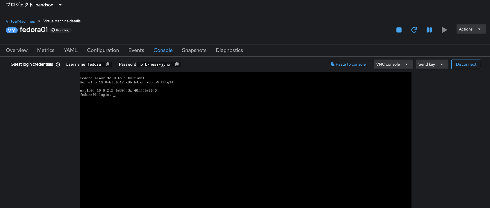

## 仮想マシンのクローン

クローンにより、ストレージとして独自のディスクイメージを使用する新しいVMが作成されますが、クローンの構成および保存データのほとんどはソースVMと同一です。

`[Overview]` 画面に戻り、`[Actions]` ドロップダウンメニューをクリックしてVMをクローニングするオプションを表示します。

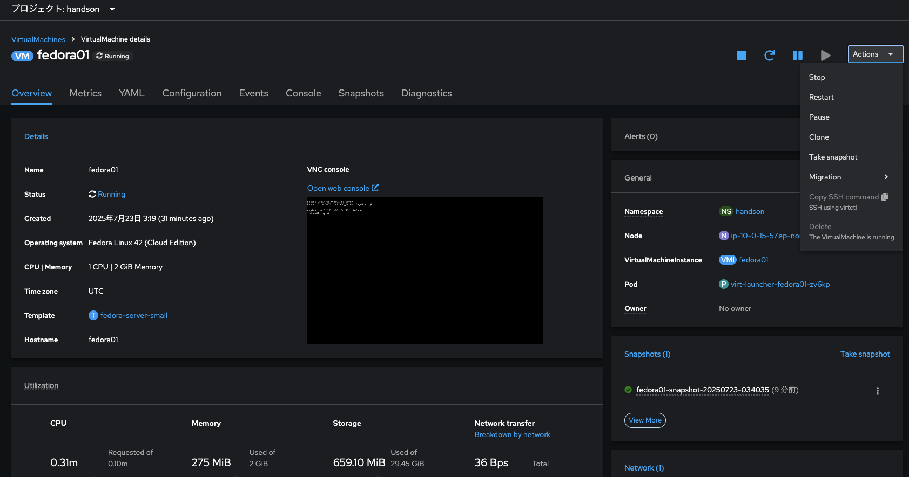

`Actions` メニューから `Clone` をクリックすると、ダイアログが開きます。 複製したVMに *fedora02* という名前を付け、`Start VirtualMachine on clone` のチェックボックスがチェックされていないことを確認してから、`[Clone]` をクリックします。

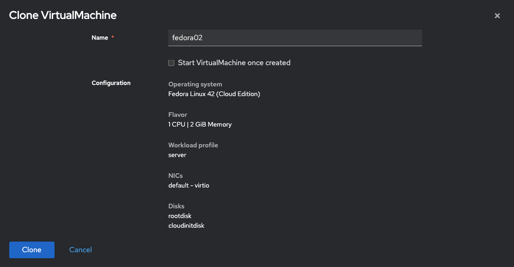

新しいVMが作成され、ディスクが複製され、ポータルが自動的に新しいVMにリダイレクトされます。 `Created` の時間がごく最近であることがわかります。

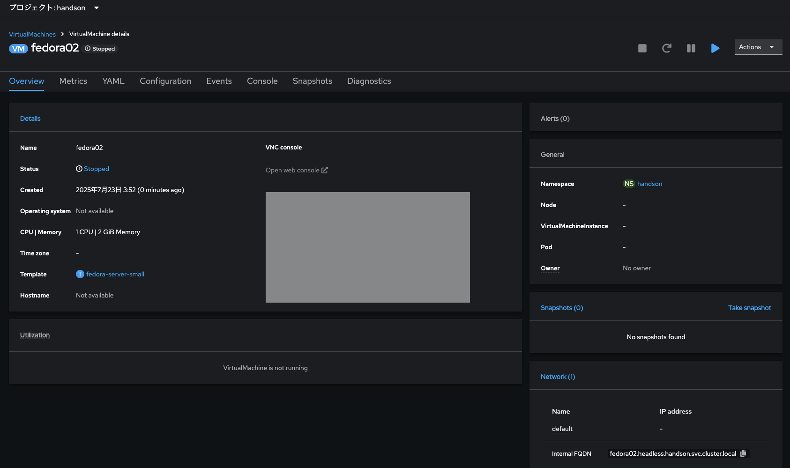

>IMPORTANT. クローンされたVMはソースVMと同じIDを持つため、VMとやり取りするアプリケーションや他のクライアントとの間で競合が発生する可能性があります。外部ネットワークに接続されているVMや同じプロジェクト内のVMをクローンする場合は、注意が必要です。

画面上部の *YAML* メニューをクリックすると、VMの名前が「*fedora02*」となっていることがわかりますが、ソースVM *fedora01* から残っているラベルがいくつかあり、これらは手動で更新する必要があります。

YAML内の *app* と *kubevirt.io/domain* の値を *fedora02* に設定し、下部の *Save* ボタンをクリックすると、*fedora02* が新しいバージョンに更新された旨のメッセージが表示されます。この作業を今行うことで、後のモジュールでこのVMを使用する際に問題を回避することができます。

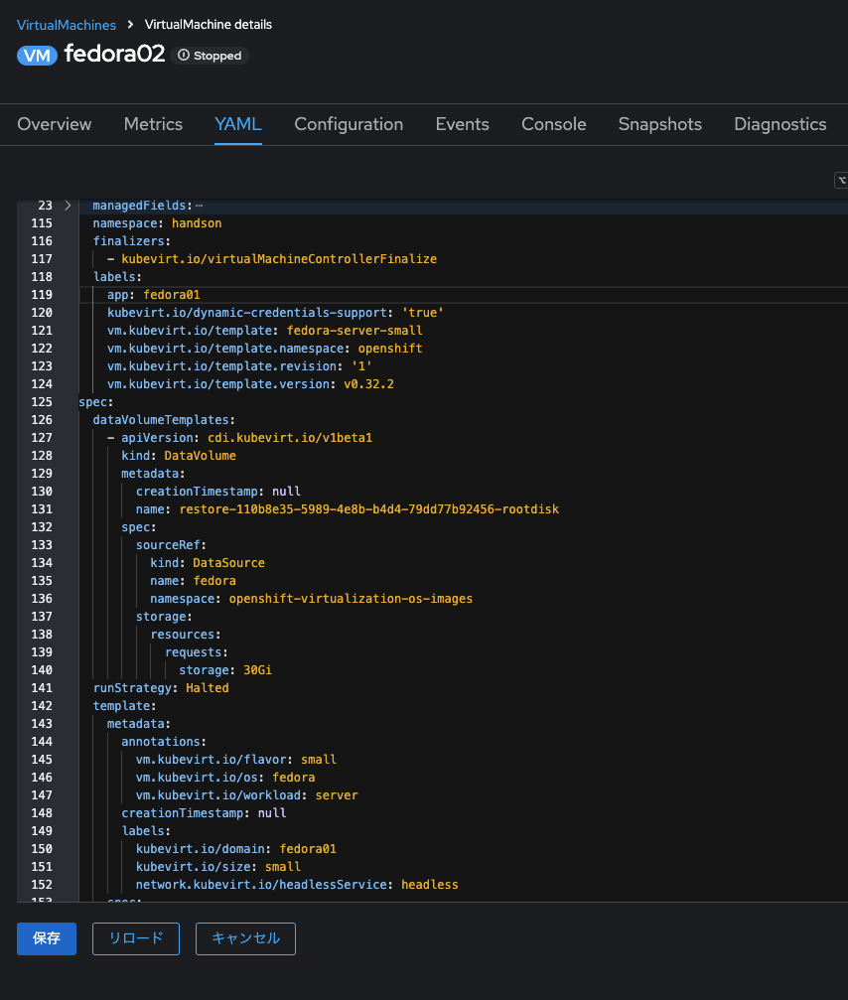

仮想マシンの YAML の変更が完了したら、*fedora01* と *fedora02* の両方を実行するように起動します。

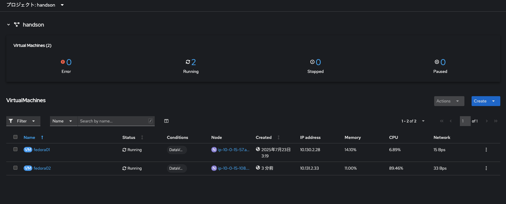

## まとめ

本章は、仮想マシンを管理する際に利用可能なストレージオプションについて説明しました。

また、仮想マシンのスナップショットを取得して基本的な復元を行うことや、他のプロジェクトで使用したり、今後の開発を効率化するために仮想マシンのクローンを作成することなど、仮想マシンに用意されたストレージに依存するいくつかのVM管理機能も実行しました。
